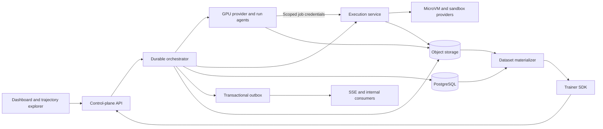
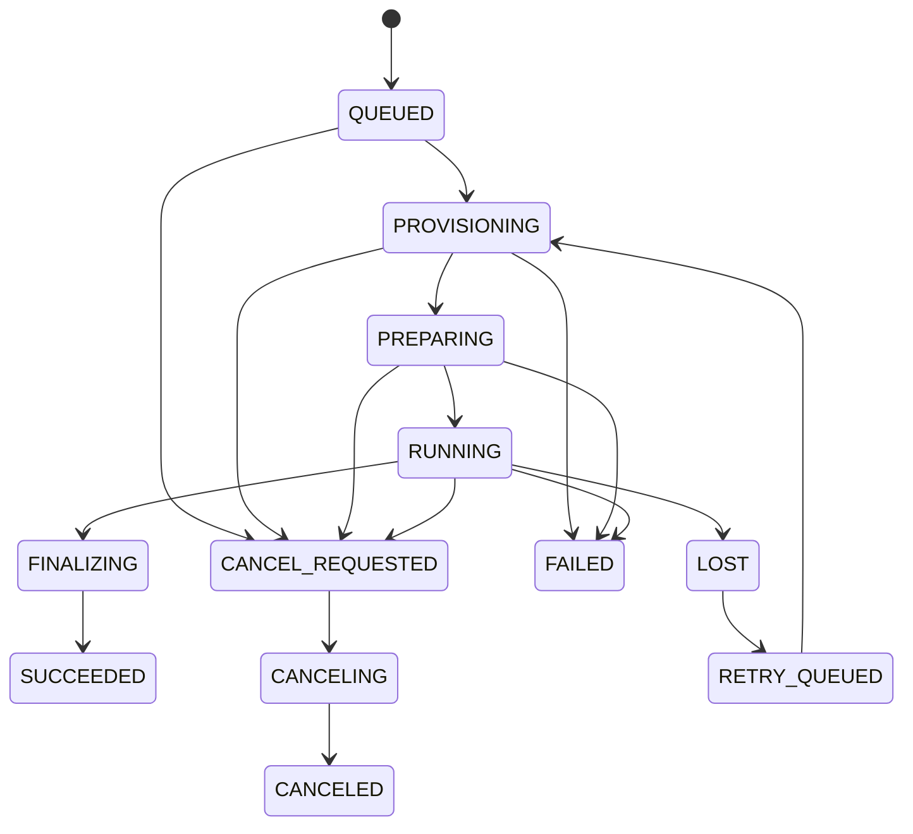

# Equinox Next

## Document control

| Field | Value |
|---|---|
| Product | Equinox |
| Document | Product and system specification |
| Version | 0.1 |
| Date | 26 July 2026 |
| Status | Draft for decision review |
| Primary users | RL researchers, environment authors, research operators |
| Initial deployment | Mac Studio control and CPU plane, RunPod GPU workers |
| Initial domains | CAD, software repositories, stateful tool or database tasks |

This document defines the next generation of Equinox. It supersedes
[`prd.md`](prd.md) for new architecture work. The existing system may continue to run
experiments while the new system is built.

[`docs/consolidation-plan.md`](docs/consolidation-plan.md) describes stabilization and
consolidation of the current implementation. It does not set the architecture for
Equinox Next. Existing experiment reports remain valid research records.

## Contents

1. Product definition
2. Goals, non-goals, and users
3. Decisions at a glance
4. Canonical language and hierarchy
5. System architecture
6. Run and iteration lifecycle
7. Environment contract
8. Checkpoints, restoration, and branching
9. Execution service
10. Evaluation and reward
11. Trainer and algorithm integration
12. Durable data model
13. Public and internal APIs
14. Dashboard and trajectory explorer
15. Security and integrity
16. Reliability, observability, and performance
17. Environment conformance suite
18. Reference environments
19. Research and comparison protocol
20. Delivery plan
21. Reuse and migration from the current repository
22. V1 acceptance test
23. Open decisions before implementation
24. Research basis
25. Glossary

## 1. Product definition

### 1.1 Product statement

Equinox is a branchable execution and evaluation platform for reinforcement learning
over expensive, stateful, externally verified environments.

Equinox lets a trainer:

1. Reach an intermediate environment state.
2. Capture a restorable checkpoint at a decision boundary.
3. Fork controlled counterfactual continuations from that checkpoint.
4. Execute and evaluate those continuations on the right compute tier.
5. Preserve the lineage and evidence needed for training.
6. Reconstruct the training examples that produced a policy update.

The platform serves BPO as its first branch-aware algorithm. The architecture also
supports independent rollouts, RLOO, GRPO, PPO, offline RL, evaluation-only search,
curricula, and algorithms that have not been designed yet.

### 1.2 Product thesis

RL systems discard expensive intermediate states after a rollout ends. Equinox turns
those states into reusable research assets.

A useful checkpoint binds four facts:

- the environment state before an action;
- the policy context that produced the action;
- the lineage that led to the state; and
- the versions and budgets that constrain valid continuations.

Forking that checkpoint gives researchers controlled comparisons between actions from a
shared state. The same primitive also supports failure replay, rare-state sampling,
human-selected restarts, evaluation search, and curriculum construction.

### 1.3 Product position

Equinox owns:

- versioned environment contracts;
- state capture, restoration, and fork execution;
- rollout and branch lineage;
- CPU and GPU work orchestration;
- versioned evaluation evidence;
- training-data materialization;
- run durability and reproducibility; and
- the dashboard and trajectory explorer.

Trainer plugins own:

- behavior-policy lifecycle;
- branch selection strategy;
- return and discount semantics;
- advantage estimation;
- tree-to-token or tree-to-action weighting;
- policy loss and optimization;
- reference-policy handling; and
- model checkpoints.

Environment plugins own:

- action and observation schemas;
- logical state serialization;
- transition execution;
- checkpoint capabilities;
- termination rules;
- verifier definitions;
- artifact roles and viewer hints; and
- resource, network, and secret policies.

### 1.4 Product quality measure

The primary efficiency measure is:

> verified, reproducible environment transitions per dollar

Raw rollout count and GPU utilization remain useful diagnostics. They do not measure the
cost or scientific value of a branch experiment on their own.

## 2. Goals, non-goals, and users

### 2.1 Product goals

Equinox Next must:

- run stateful multi-turn environments;
- preserve observation, logical state, runtime state, and policy context as separate
  concepts;
- fork an eligible checkpoint into isolated sibling continuations;
- run CPU-heavy execution and verification without tying their lifecycle to a web
  process;
- keep infrastructure failures out of policy rewards;
- retain the evidence behind each reward;
- bind policy decisions to immutable behavior-policy versions;
- survive API, orchestrator, GPU worker, and CPU worker restarts;
- expose the real rollout trees that produced each training iteration;
- compare branching and independent rollouts under a multidimensional budget;
- export portable sequential data with branch lineage; and
- test each environment against a conformance suite.

### 2.2 Research goals

The first research program must answer:

- Does a sibling comparison from one restored state reduce useful gradient variance?
- Which branch selection strategies work across task types?
- Which environment RNG mode gives the intended counterfactual?
- How do branch width and branch depth affect learning and cost?
- Which credit estimators remain useful when siblings fail or arrive late?
- Does state reuse help beyond BPO through replay, curricula, or search?

Equinox must preserve enough data to change the estimator after collection. Researchers
must not rerun an expensive environment because the first reward transform or advantage
formula was wrong.

### 2.3 Non-goals for v1

Version 1 does not include:

- recursive branch-from-branch execution;
- token-prefix branching inside model generation;
- asynchronous learning across stale policy versions;
- automatic environment generation;
- an environment marketplace;
- a general-purpose workflow engine;
- a public multi-tenant SaaS;
- a new RL framework;
- a claim that BPO beats every independent-rollout baseline; or
- a universal microVM backend.

The data model may leave room for these features. The v1 runtime must reject unsupported
operations instead of approximating them.

### 2.4 Primary users

#### Research operator

The operator launches runs, watches cost and progress, inspects failed work, compares
experiments, cancels runs, and reproduces prior manifests.

#### RL researcher

The researcher implements branch strategies and credit estimators, consumes immutable
rollout trees, and links each optimizer update to the data that caused it.

#### Environment author

The author packages a stateful task, declares schemas and capabilities, implements state
save and restore, defines evaluations, and passes the conformance suite.

#### Platform developer

The developer adds compute providers, maintains the orchestrator and execution service,
and investigates performance or recovery failures.

## 3. Decisions at a glance

| ID | Area | Decision |
|---|---|---|
| EQX-001 | Product boundary | Build a branchable execution and evaluation platform with trainer plugins |
| EQX-002 | System of record | The orchestrator owns scientific run state and lineage |
| EQX-003 | Metadata store | Use PostgreSQL in production |
| EQX-004 | Artifact store | Use content-addressed S3-compatible object storage |
| EQX-005 | Events | Use typed append-only events with a transactional outbox |
| EQX-006 | Live UI | Use cursor-based SSE, with polling as fallback |
| EQX-007 | GPU provider | Support RunPod first through a provider interface |
| EQX-008 | GPU process | Run a detached, reconnectable run agent on the GPU allocation |
| EQX-009 | CPU plane | Expose stateful sessions and asynchronous evaluation jobs |
| EQX-010 | Initial CPU host | Use the Mac Studio through a provider-neutral execution service |
| EQX-011 | Environment packaging | Use an OCI image plus a versioned manifest and schemas |
| EQX-012 | Checkpoint model | Bind logical state, runtime snapshot, policy context, lineage, RNG, and budgets |
| EQX-013 | Branch topology | Support a backbone with one-level sibling groups in v1 |
| EQX-014 | Algorithm ownership | Trainer plugins define branch selection and credit assignment |
| EQX-015 | Failure semantics | Separate policy outcomes from infrastructure and evaluator failures |
| EQX-016 | Reward model | Store evidence and named metrics before deriving a scalar reward |
| EQX-017 | Reproducibility | Pin source, images, models, tasks, environments, verifiers, configs, seeds, and hardware |
| EQX-018 | Generic UI | Render typed artifacts through a fixed viewer registry |
| EQX-019 | Local development | Local substitutes may exist, but production semantics remain the reference |
| EQX-020 | Tenancy | Ship a single-user v1 with project and ownership fields in the schema |

## 4. Canonical language and hierarchy

Equinox must avoid `step` as a canonical database entity. Existing code uses the word for
an optimizer update and an environment action.

```text
Project
└── Run
    └── RunAttempt
        └── TrainingIteration
            └── RolloutTree
                ├── Rollout
                ├── State
                ├── PolicyDecision
                ├── Transition
                └── BranchGroup
                    └── BranchMember
```

| Term | Definition |
|---|---|
| Run | Immutable scientific intent and normalized launch manifest |
| RunAttempt | One execution attempt for a run |
| TrainingIteration | One policy update boundary with an input and output policy version |
| RolloutTree | One task reset and its shared branching history |
| Rollout | One root-to-leaf continuation through a rollout tree |
| State | One immutable environment boundary before a policy decision |
| Observation | The policy-visible projection of a state |
| PolicyDecision | Policy context, sampling metadata, action output, and behavior metadata |
| Action | The typed command proposed by the policy |
| Transition | Accepted execution of an action from one state to another |
| Checkpoint | A branchable binding of state, runtime, policy context, RNG, and budget |
| BranchGroup | A requested sibling set from one checkpoint |
| BranchMember | One sibling continuation and its role in a branch group |
| Evaluation | Versioned evidence produced by a verifier |
| RewardSignal | A named scalar derived by a versioned reward pipeline |

The UI may label a training iteration as an "iteration." It may label a transition as an
"action" when that term reads better for the environment.

## 5. System architecture



### 5.1 Dashboard

The dashboard:

- calls the public orchestrator API;
- reads signed artifact URLs;
- subscribes to the run event stream;
- stores no scientific state;
- launches runs from typed templates;
- presents operational and research views; and
- links each training iteration to its source rollout trees.

The dashboard does not manage pods, parse trainer logs into metrics, render hidden
targets, or write trajectory rows.

### 5.2 Orchestrator

The orchestrator acts as the sole authority for:

- run manifests and lifecycle;
- run attempts;
- policy versions and training iterations;
- rollout, state, transition, and branch lineage;
- job authorization and correlation;
- budget admission and accounting;
- GPU allocation desired state;
- cancellation and retry policy;
- training eligibility;
- durable event ingestion;
- artifact metadata;
- checkpoint publication; and
- finalization.

The orchestrator does not execute candidate code, import CAD packages, run tests, render
artifacts, or define an RL loss.

### 5.3 GPU run agent

The run agent runs inside the GPU allocation and:

- starts from an immutable run bundle;
- loads the trainer and behavior policy;
- publishes heartbeats;
- creates and commits training iterations;
- submits or authorizes rollout work;
- emits typed metrics and events;
- publishes model and optimizer checkpoints;
- honors cancellation; and
- reconnects after control-plane restarts.

An SSH session may bootstrap or debug the agent. The SSH process must not own the run
lifecycle.

### 5.4 Execution service

The execution service owns:

- session and microVM lifecycle;
- environment image and workload profile resolution;
- actions against stateful sessions;
- snapshot, restore, fork, and fidelity probes;
- CPU job queues and attempts;
- leases, heartbeats, retries, and timeouts;
- resource and network enforcement;
- trusted verifier execution;
- artifact upload;
- operational capacity data; and
- orphan reconciliation.

The service records provider handles and attempt state in its operational store. It
returns typed results to the orchestrator and does not create scientific lineage on its
own.

### 5.5 Data plane rule

Large payloads move through object storage. The orchestrator passes artifact references
and signed credentials, not STL files, images, source trees, or model checkpoints in API
payloads.

The trainer may submit high-volume execution jobs to the execution service with
run-scoped credentials. The orchestrator must authorize the operation and remain the
authority for accepted results.

## 6. Run and iteration lifecycle

### 6.1 Run manifest

A run manifest must pin:

```yaml
project_id: project-equinox
environment:
  id: cad.reconstruction
  version: "1.0.0"
  image_digest: "sha256:..."
task_pack:
  id: cad-reference
  revision: "sha256:..."
algorithm:
  id: bpo-local
  version: "0.1.0"
trainer:
  image_digest: "sha256:..."
model:
  revision: "..."
  tokenizer_revision: "..."
gpu:
  provider: runpod
  resource_profile: a100-80gb
cpu:
  execution_profile: studio-default
branch:
  strategy: fixed-boundary
  width: 4
  max_backbone_points: 1
budgets:
  policy_tokens: 1000000
  policy_gpu_seconds: 36000
  environment_cpu_seconds: 72000
  verifier_cpu_seconds: 72000
  wall_clock_seconds: 86400
  transitions: 10000
retention:
  class: research
seed_manifest:
  run_seed: 1234
```

The API normalizes the manifest before launch. The normalized form receives a digest and
does not change after creation.

### 6.2 Run and attempt states



A `Run` keeps scientific intent. A `RunAttempt` records one execution. A retry creates a
new attempt under the same run.

The run records a separate scientific outcome and cleanup outcome. A successful training
result can coexist with a leaked-allocation alert until reconciliation releases the
resource.

### 6.3 Training iteration states

```text
PLANNED
  -> COLLECTING
  -> EXECUTING
  -> EVALUATING
  -> MATERIALIZING
  -> OPTIMIZING
  -> COMMITTING
  -> COMMITTED
```

Each iteration stores:

- input behavior-policy version;
- reference-policy version when used;
- rollout trees admitted to the update;
- excluded trees and reasons;
- estimator and loss configuration;
- optimizer inputs and outputs;
- output policy version;
- metrics and budget deltas; and
- a commit operation ID.

Only `COMMITTED` advances the current policy version. A retry of `COMMITTING` must not
apply the optimizer update twice.

### 6.4 Cancellation

The run API supports:

- `checkpoint_then_cancel`;
- `finish_iteration_then_cancel`; and
- `terminate`.

Cancellation sets desired state. The run agent, execution service, and provider
reconcilers observe it. Deleting a pod or VM does not count as cancellation.

### 6.5 Finalization and provenance

Each run template declares required final artifacts. A training run should require:

- normalized run manifest;
- complete entity and event lineage;
- final metric summary;
- last committed model checkpoint;
- optimizer checkpoint when resume is supported;
- training dataset materialization manifests;
- required evaluation evidence; and
- artifact digests.

The orchestrator marks scientific success after these artifacts commit. Allocation
cleanup continues under its own state and can surface a warning without changing the
scientific result.

A run attempt records:

- source commit and immutable source-bundle digest, including a dirty diff when present;
- trainer, environment, execution, and verifier image digests;
- model, tokenizer, task-pack, and reward-pipeline revisions;
- normalized configuration;
- all seed manifests;
- provider and hardware class;
- runtime and driver versions; and
- input and output policy versions.

The `reproduce` command creates a new run linked to the source manifest. It does not
resume or modify the original run.

## 7. Environment contract

### 7.1 Environment package

An environment version consists of:

- an immutable manifest;
- an OCI image digest;
- action, observation, logical-state, and result schemas;
- a task-pack contract;
- save, restore, and digest hooks;
- termination and truncation rules;
- evaluation specifications;
- artifact roles and viewer hints;
- resource limits;
- network and secret policies;
- declared checkpoint capabilities;
- supported RNG fork modes; and
- conformance results.

Illustrative manifest:

```yaml
environment_id: software.repo-fix
version: "1.0.0"
runtime_image_digest: "sha256:..."
schemas:
  action: "artifact://schemas/repo-action-v1.json"
  observation: "artifact://schemas/repo-observation-v1.json"
  logical_state: "artifact://schemas/repo-state-v1.json"
reset_modes:
  - clean-task
checkpoint_capabilities:
  - logical_restore
  - filesystem_restore
fork_rng_modes:
  - clone_stream
  - split_stream
termination_conditions:
  - submitted
  - solved
default_budgets:
  turns: 40
  cpu_seconds: 1800
evaluation_specs:
  - hidden-tests@1
evaluation_triggers:
  - terminal
artifact_viewers:
  - source-diff
  - test-report
network_policy: disabled
secrets_policy: none
determinism_claim: deterministic-under-seed
```

### 7.2 Required operations

```text
create_session(environment_version, task_revision, seed, budgets)
reset(session_id, operation_id)
step(session_id, expected_state_id, action, operation_id)
save_state(session_id, state_id, operation_id)
restore_state(checkpoint_id, rng_mode, operation_id)
fork(checkpoint_id, child_specs, operation_id)
evaluate(state_id, evaluation_spec, operation_id)
cancel(operation_id)
close_session(session_id, operation_id)
```

`step()` returns committed identifiers. Clients must not discover a new state by loading
a rollout tree and taking its last node.

### 7.3 Transition semantics

Each transition records one of these outcomes:

| Outcome | Meaning |
|---|---|
| `continued` | The action produced another valid state |
| `terminated` | The environment reached a semantic terminal state |
| `truncated` | A configured budget or horizon ended a valid rollout |
| `invalid_action` | The environment rejected the action as a policy outcome |
| `policy_aborted` | The policy produced no usable action |
| `cancelled` | A user or scheduler stopped the operation |
| `infra_failed` | The platform failed to obtain the requested transition |
| `evaluation_failed` | Execution completed but the verifier failed |

The trainer decides how supported policy outcomes affect reward. `infra_failed` and
`evaluation_failed` produce no reward until a declared recovery or exclusion rule runs.

### 7.4 State model

Equinox separates:

- **Observation:** data available to the policy.
- **Logical state:** serialized task state needed for semantic restoration.
- **Runtime snapshot:** provider data used to restore execution fast.
- **Policy context:** model input, hidden state, conversation, tools, and sampling data.
- **Evaluation state:** hidden inputs and invariants used by trusted verifiers.

Every initial reset creates a first-class state with:

- task and environment revisions;
- reset mode and seed;
- initial observation artifact;
- logical-state artifact and schema version;
- state digest;
- budget ledger position; and
- runtime identity.

Every action and observation receives a canonical artifact reference. Hash-only records
do not satisfy replay or inspection requirements.

An environment may request evaluation after each transition, at declared milestones, at
termination, or on explicit submission. The trigger belongs to the environment and run
manifest. Presentation-only rendering does not block training unless the evaluation
specification names the render as required evidence.

### 7.5 Idempotency and concurrency

Each mutating operation includes:

- a caller-generated `operation_id`;
- an idempotency key;
- a canonical request digest;
- an expected aggregate or state version; and
- correlation identifiers.

A repeated key with a different request digest returns a conflict. A repeated key with
the same digest returns the prior result.

Stateful commands use `expected_state_id`. The execution service rejects concurrent
actions against the same session state unless the environment declares a safe concurrent
operation.

Equinox uses a recoverable saga across services:

1. The orchestrator records intent.
2. The execution service performs an idempotent operation.
3. The service stores output artifacts and a typed result.
4. The orchestrator accepts the result once and appends scientific lineage.
5. A reconciler repairs interrupted handoffs from the operation record.

The design does not require a distributed database transaction.

## 8. Checkpoints, restoration, and branching

### 8.1 Checkpoint contract

A ready checkpoint binds:

- source state ID;
- source transition and rollout-tree lineage;
- environment and task revisions;
- logical-state artifact and schema version;
- logical state digest;
- runtime snapshot operation and provider handle;
- runtime image and capability level;
- fidelity probe result;
- policy-context artifact;
- behavior-policy version;
- tokenizer, prompt template, and tool schema versions;
- sampling configuration;
- environment and policy RNG state;
- remaining budgets; and
- creation provenance.

The runtime snapshot operation and snapshot bytes are separate records. Two operations
may produce the same content digest while retaining distinct provenance.

### 8.2 Fidelity levels

| Level | Guarantee |
|---|---|
| Logical restore | Restore a semantically equivalent task state |
| Filesystem restore | Restore files and persisted service state |
| Process restore | Restore process memory and open runtime context |
| Full runtime restore | Restore a microVM or equivalent boundary |
| Exogenous replay | Reproduce recorded external events, clocks, and randomness |

An environment declares its supported levels. A checkpoint records the level obtained,
not the level requested.

Every production checkpoint runs an environment-supplied probe. A live VM without a
matching state digest does not pass.

### 8.3 RNG fork modes

Each fork declares one environment RNG mode:

| Mode | Semantics |
|---|---|
| `clone_stream` | Each child begins from the same environment RNG state |
| `split_stream` | Each child receives a deterministic stream derived from the parent |
| `fresh_entropy` | Each child receives new nondeterministic entropy |
| `replay_recorded` | Each child consumes a recorded external event stream |

Policy sampling RNG remains separate from environment RNG.

`clone_stream` supports paired counterfactual comparison. `split_stream` supports
comparison across independent futures. The branch plan must state which question it
tests.

### 8.4 Branch plan

The trainer submits a versioned branch plan:

```json
{
  "strategy_id": "fixed-boundary@1",
  "source_state_id": "state-...",
  "checkpoint_id": "checkpoint-...",
  "width": 4,
  "topology": "backbone-side-branches",
  "environment_rng_mode": "clone_stream",
  "policy_sampling_mode": "independent",
  "behavior_policy_version_id": "policy-...",
  "member_budget_policy": "inherit-remaining",
  "completion_rule": "all-members",
  "failure_rule": "retry-then-exclude",
  "deadline_at": "..."
}
```

The orchestrator validates the plan, reserves budget, and asks the execution service to
fork the checkpoint. The orchestrator does not compute entropy or advantages.

A branch strategy that chooses points after the backbone finishes must declare how the
runtime retains those states. Supported choices are:

- keep forkable handles for each eligible state;
- create provisional checkpoints and discard unselected ones;
- replay a deterministic prefix under a conformance-backed environment; or
- choose points online.

The trainer cannot request a branch from an intermediate state that no longer has a
restorable representation.

### 8.5 V1 topology

V1 supports:

- one backbone rollout per rollout tree;
- one or more selected branch points on that backbone;
- the backbone continuation as sibling index 1 when the algorithm requests it;
- `K - 1` restored continuations from each selected point; and
- terminal or truncated outcomes for each sibling.

V1 rejects branch points created inside a side continuation. The schema keeps parent
lineage that can support recursion in a later version.

The first production path uses one branch point and width four. This reduces systems and
algorithm ambiguity while the team validates state fidelity and trainer integration.

### 8.6 Sibling consistency

A trainable sibling group must pin:

- one source checkpoint;
- one behavior-policy version;
- one policy context digest;
- one tokenizer and prompt template;
- one sampling configuration, except member RNG seeds;
- one environment and task revision;
- one evaluation specification;
- one reward-pipeline version;
- one inherited budget policy; and
- one branch strategy version.

Policy updates cannot occur while the trainer constructs a strict same-version group.
Duplicate sampled actions remain valid samples.

### 8.7 Failure and admission rules

Infrastructure retries remain attempts of the same branch member and logical operation.
They must use the original policy and environment versions.

The default v1 rule:

1. Retry a retryable infrastructure failure within the member deadline.
2. accept a declared policy timeout as a terminal or truncated outcome when the
   environment defines it;
3. exclude the group when a required member has no valid outcome; and
4. retain all failed attempts and exclusion reasons.

The platform stores training eligibility as a versioned decision record. It does not
overwrite trajectory facts with a mutable boolean.

### 8.8 Budget semantics

Forking copies the remaining budget. It does not refresh it.

Equinox records:

```text
policy_input_tokens
policy_output_tokens
policy_gpu_seconds
environment_cpu_seconds
environment_gpu_seconds
verifier_cpu_seconds
wall_clock_seconds
transitions
terminal_rollouts
snapshots_created
snapshot_bytes_written
snapshot_bytes_restored
artifact_bytes
external_service_cost
retry_cost
```

Reports separate shared-prefix cost, snapshot cost, and sibling suffix cost. Equal leaf
counts do not imply equal compute.

## 9. Execution service

### 9.1 Service surfaces

The service exposes two related APIs.

#### Stateful environment API

```text
POST   /v1/sessions
GET    /v1/sessions/{session_id}
POST   /v1/sessions/{session_id}/actions
POST   /v1/sessions/{session_id}/checkpoints
POST   /v1/checkpoints/{checkpoint_id}/restores
POST   /v1/checkpoints/{checkpoint_id}/forks
DELETE /v1/sessions/{session_id}
DELETE /v1/checkpoints/{checkpoint_id}
```

#### Evaluation job API

```text
POST /v1/evaluation-batches
GET  /v1/evaluation-batches/{batch_id}
GET  /v1/jobs/{job_id}
GET  /v1/jobs/{job_id}/events
POST /v1/jobs/{job_id}/cancel
GET  /v1/capacity
GET  /v1/profiles
```

### 9.2 Job and attempt model

An `ExecutionJob` represents one logical request. An `ExecutionAttempt` records one
lease, VM, provider, and retry.

```text
SUBMITTED
  -> LEASED
  -> VM_STARTING
  -> RUNNING
  -> UPLOADING
  -> SUCCEEDED
```

Alternative outcomes:

```text
TASK_FAILED
INFRA_FAILED -> RETRY_PENDING
TIMED_OUT
CANCELED
```

The service keeps the logical job ID across retries. The orchestrator accepts one result
for the job operation.

### 9.3 Workload profiles

The execution service runs registered profiles instead of arbitrary shell commands.

Examples:

```text
cadquery.execute@1
cad.geometry-verify@1
cad.render@1
python.hidden-tests@1
image.pixel-compare@1
image.perceptual-compare@1
stateful.crm-actions@1
```

Each profile pins:

- image or VM template digest;
- accepted input and output schemas;
- resource defaults and ceilings;
- network and dependency policy;
- determinism and caching policy;
- snapshot support;
- output artifact roles;
- evaluator and renderer versions; and
- trust class.

### 9.4 Trust classes

The service separates:

#### Public execution

Runs candidate code with public task assets. It cannot access hidden targets or verifier
secrets.

#### Trusted artifact evaluation

Receives immutable candidate artifacts and hidden evaluation inputs. It avoids executing
candidate source when a safer artifact-level check exists.

#### Hidden-test execution

Runs candidate code against hidden tests when the task requires it. This profile needs a
specific threat model because candidate code and hidden assets share a runtime boundary.

The UI process does not load hidden catalogs or run lazy render work.

### 9.5 Scheduling and capacity

The scheduler must support:

- resource classes by profile;
- CPU, memory, disk, VM, and process limits;
- fair share across runs;
- priority classes for interactive and training work;
- admission control and backpressure;
- warm pools by environment version;
- snapshot-local placement;
- straggler deadlines;
- cancellation propagation;
- VM recycling and quarantine; and
- queue and capacity reporting.

The trainer should not block an expensive GPU on one monolithic CPU request. The
execution service returns job-level results and supports batch progress.

### 9.6 Caching

V1 may cache:

- deterministic verification by candidate, task, and verifier digests;
- rendering by input, renderer, camera, and size digests; and
- immutable preprocessing transforms.

V1 does not cache state-mutating environment actions.

Cache keys include profile and image digests, normalized parameters, all inputs, task
revision, hidden input revision, seed, and CPU architecture when numeric results depend
on it.

The service never caches infrastructure failures. A cache hit still creates an attempt
record for cost and lineage.

### 9.7 Studio deployment

The Mac Studio hosts the first execution service and worker pool. The service must keep
provider details behind an interface.

The team must select the first microVM implementation through a spike that measures:

- Linux ARM guest compatibility;
- snapshot fidelity level;
- restore latency distribution;
- copy-on-write behavior;
- resource limits;
- secret and identity rehydration;
- operational recovery; and
- integration complexity.

The architecture does not assume Firecracker can run on macOS.

## 10. Evaluation and reward

### 10.1 Evaluation evidence

An evaluation stores:

```text
evaluation_spec_version
environment_version
task_revision
subject_state_id
subject_artifact_refs
state_digest
verifier_image_digest
hidden_input_bundle_digest
started_at
completed_at
attempt_number
named_metrics
hard_constraints
diagnostics
evidence_artifacts
stdout_ref
stderr_ref
resource_consumption
failure_classification
```

The evaluation result exists before a scalar training reward.

### 10.2 Reward pipeline

```text
evaluation evidence
  -> normalized metrics
  -> gates and penalties
  -> reward pipeline version
  -> named RewardSignals
  -> scalar training reward
```

Researchers may apply a new reward-pipeline version to stored evidence. The new result
supersedes neither the original evaluation nor the reward used by a committed training
iteration.

Each training iteration pins the reward-pipeline version used for optimization.

Human adjudication creates a new evaluation or annotation linked to the original result.
It does not overwrite machine evidence.

### 10.3 Verifier requirements

Verifiers must:

- resolve hidden inputs from a task reference;
- pin image and dependency digests;
- produce a full operator report;
- produce a versioned policy-visible projection when feedback returns to the agent;
- separate candidate failure from verifier failure;
- record deterministic seeds or declared variance;
- include evidence for audit;
- support calibration cases with known positive and negative outcomes; and
- check collateral damage when the task has external state.

The platform supports more than one verifier per state. A reward pipeline may combine
their evidence.

### 10.4 Reference domain outputs

CAD evaluation may produce geometry validity, alignment, surface similarity, occupancy,
dimensions, topology, constraint compliance, execution cost, and render artifacts.

Software evaluation may produce required-test results, regression results, static
checks, patch constraints, changed-file summaries, runtime, and logs.

Stateful tool evaluation may produce final database invariants, side-effect constraints,
policy compliance, milestone completion, and reliability over repeated trials.

## 11. Trainer and algorithm integration

### 11.1 Platform contract

The platform gives a trainer:

- immutable rollout trees;
- exact action and observation artifacts;
- policy decision metadata;
- behavior log probabilities when supplied;
- evaluation evidence and reward signals;
- branch-group identity;
- budgets and costs;
- training eligibility decisions; and
- dataset materialization by iteration.

The trainer gives the platform:

- policy versions;
- decision metadata;
- branch plans;
- iteration boundaries;
- estimator and loss manifests;
- output checkpoints;
- metrics; and
- commit operations.

### 11.2 Policy version

A policy version includes:

- model or adapter digest;
- base model revision;
- tokenizer revision;
- prompt or chat-template version;
- tool-schema version;
- sampling configuration;
- inference build identifier;
- optimizer checkpoint lineage; and
- reference-policy version when used.

A model name at run scope does not identify behavior under asynchronous collection.

### 11.3 Policy decision record

The record supports both generic policies and LLM extensions.

Core fields:

- source state and observation digests;
- policy version;
- policy-context artifact;
- action artifact;
- sampling seed;
- decision start and end time; and
- inference allocation.

Optional LLM fields:

- input and output token IDs;
- token spans and masks;
- old log probabilities;
- entropy or branch-strategy signals;
- value estimates;
- truncation data; and
- structured tool-call representation.

### 11.4 BPO support

Equinox treats BPO as a trainer plugin built from generic branch primitives.

Initial algorithm modes:

| Mode | Purpose |
|---|---|
| `independent_rollout_baseline` | Matched conventional baseline |
| `bpo_local` | Sibling return comparison at the branch action |
| `bpo_paper_v1` | Experimental reproduction of the paper's propagation choices |
| `evaluation_only_branch_search` | Branch collection without policy updates |

The trainer version records:

- branch selection policy;
- sibling baseline and normalization;
- return definition;
- discount and propagation;
- tree weighting;
- masks;
- clipping;
- missing-member rule; and
- required behavior metadata.

The orchestrator does not contain these formulas.

Behavior log probabilities must correspond to the sampling distribution that produced
the action, including temperature, top-p, truncation, and other transforms. A group retry
under new weights creates invalid on-policy data and must not enter a strict same-version
group.

### 11.5 V1 training restrictions

The first branch-aware training path uses:

- one real multi-turn policy;
- one branch point per rollout tree;
- width four;
- terminal rewards;
- one frozen behavior policy for the complete group;
- synchronous same-version group collection; and
- a named local sibling estimator.

Later releases may add multiple backbone points, entropy selection, PPO clipping, dense
rewards, recursive branching, and bounded-staleness collection.

### 11.6 Dataset materialization

The canonical store shares prefixes. The materializer creates framework-neutral training
examples with an explicit multiplicity and weighting rule.

Exports must support:

- linear RLDS-compatible rollouts;
- branch-aware lineage extensions;
- one row per transition;
- one row per root-to-leaf rollout;
- branch-group datasets; and
- iteration manifests that reconstruct the optimizer input.

The materializer writes its version and query manifest into the committed iteration.

## 12. Durable data model

### 12.1 Scientific records and operational projections

Equinox stores scientific facts as immutable records. Corrections create supersession
records. Mutable projections support queues, dashboards, and current status.

OpenTelemetry traces help operators debug services. They do not replace business events
or scientific lineage.

### 12.2 Core entities

#### Project

Namespace for runs, environments, task packs, budgets, and ownership.

#### EnvironmentVersion

Immutable environment manifest, image, schemas, capabilities, and conformance result.

#### TaskPack and TaskRevision

Versioned task collections and immutable task instances with public and hidden artifact
roles.

#### Run

Normalized experiment intent, provenance, budget, and retention policy.

#### RunAttempt

One execution of a run with allocation, failure, and recovery history.

#### ComputeAllocation

Provider resource with desired and observed state. It remains separate from run outcome.

#### PolicyVersion

Immutable behavior-policy identity and checkpoint lineage.

#### TrainingIteration

Atomic input-policy to output-policy update.

#### RolloutTree

One task reset with states, transitions, rollouts, and branch groups.

#### Rollout

One root-to-leaf path through a rollout tree.

#### State

Environment boundary with logical state, observation, digest, budget position, and
runtime identity.

#### PolicyDecision

Policy context, action output, sampling metadata, and optional token data.

#### Action

Typed canonical action artifact.

#### Transition

Source state, action, accepted execution result, and destination state.

#### Checkpoint

Branchable binding described in section 8.1.

#### BranchGroup and BranchMember

Requested sibling set and each realized continuation.

#### ExecutionJob and ExecutionAttempt

Logical CPU or environment work and provider retries.

#### EvaluationSpec and Evaluation

Versioned verifier contract and one result with evidence.

#### RewardPipeline and RewardSignal

Versioned evidence transform and named scalar outputs.

#### ArtifactBlob and ArtifactRef

Content-addressed bytes and contextual use. The blob digest does not carry a semantic
role. `ArtifactRef` records entity, role, ordinal, media type, and viewer hint.

#### BudgetLedger

Append-only reservations, charges, releases, adjustments, and current projections.

#### EligibilityDecision

Versioned reason that admits or excludes data from a training iteration.

#### Event

Typed state change or fact with aggregate sequence and correlation metadata.

### 12.3 Required invariants

- A state belongs to one rollout tree.
- A transition names one source state and at most one accepted destination state.
- A source state cannot accept two sequential actions under the same session version
  unless a fork creates independent child sessions.
- A branch group names one source checkpoint.
- Branch members use unique sibling indexes.
- A strict sibling group uses one behavior-policy and evaluation version.
- A terminal state has no outgoing sequential transition.
- Infrastructure failures do not create reward-bearing destination states.
- An optimizer commit names one input and one output policy version.
- A committed iteration cannot change its admitted data or reward version.
- An artifact blob digest identifies bytes. Artifact roles live on references.
- An idempotency key maps to one canonical request digest.
- Budget charges name the operation that caused them.

### 12.4 Business event envelope

```json
{
  "event_id": "evt-...",
  "event_type": "transition.accepted",
  "schema_version": 1,
  "aggregate_type": "rollout_tree",
  "aggregate_id": "tree-...",
  "aggregate_sequence": 42,
  "run_id": "run-...",
  "attempt_id": "attempt-...",
  "training_iteration_id": "iter-...",
  "rollout_tree_id": "tree-...",
  "operation_id": "op-...",
  "correlation_id": "corr-...",
  "causation_id": "evt-...",
  "trace_id": "...",
  "occurred_at": "...",
  "recorded_at": "...",
  "producer": "execution-service",
  "payload": {}
}
```

Large payloads appear as artifact references.

### 12.5 Storage rules

PostgreSQL stores:

- identities and relationships;
- state machines and projections;
- event and outbox records;
- budget ledgers;
- version metadata;
- small typed results; and
- artifact metadata.

Object storage holds:

- source bundles and patches;
- observations and policy contexts;
- logical-state artifacts;
- runtime snapshots or snapshot layers;
- images, meshes, and renders;
- test reports and logs;
- evaluation evidence;
- model and optimizer checkpoints; and
- dataset exports.

Production schema changes use migrations. SQLite may support tests and local demos. A
SQLite deployment does not qualify for production durability or concurrency acceptance.

## 13. Public and internal APIs

### 13.1 Public control-plane API

```text
GET    /v1/run-templates
POST   /v1/runs
GET    /v1/runs
GET    /v1/runs/{run_id}
POST   /v1/runs/{run_id}/cancel
POST   /v1/runs/{run_id}/reproduce

GET    /v1/runs/{run_id}/attempts
GET    /v1/runs/{run_id}/iterations
GET    /v1/iterations/{iteration_id}
GET    /v1/iterations/{iteration_id}/rollout-trees

GET    /v1/rollout-trees/{tree_id}
GET    /v1/rollout-trees/{tree_id}/graph
GET    /v1/states/{state_id}
GET    /v1/transitions/{transition_id}
GET    /v1/branch-groups/{branch_group_id}

GET    /v1/runs/{run_id}/events?after={cursor}
GET    /v1/runs/{run_id}/stream?after={cursor}
GET    /v1/artifacts/{artifact_id}
```

List endpoints support pagination, filters, and stable cursors.

### 13.2 Trainer API

```text
POST /v1/run-attempts/{attempt_id}/heartbeats
POST /v1/policy-versions
POST /v1/training-iterations
POST /v1/training-iterations/{id}/branch-plans
POST /v1/training-iterations/{id}/events
POST /v1/training-iterations/{id}/materializations
POST /v1/training-iterations/{id}/commit
POST /v1/training-iterations/{id}/fail
POST /v1/checkpoints/publish
```

The SDK wraps these calls and standardizes operation IDs, retries, artifact upload, and
event schemas.

### 13.3 Query projections

The API returns read models designed for the UI:

- `RunTemplate`;
- `RunSummary`;
- `RunDetail`;
- `IterationSummary`;
- `IterationDetail`;
- `RolloutTreeSummary`;
- `RolloutTreeGraph`;
- `TransitionDetail`;
- `BranchGroupComparison`;
- `MetricDescriptor`;
- `ArtifactDescriptor`;
- `ResourceAllocationSummary`; and
- `FailureDetail`.

The browser must not join normalized tables, parse human log lines, or fetch full
artifacts to build a thumbnail list.

### 13.4 Error model

Errors include:

- stable code;
- category;
- retryability;
- operation and correlation IDs;
- human message;
- structured details;
- related entity IDs; and
- documentation hint when useful.

Categories:

```text
USER_CONFIGURATION
POLICY_OUTCOME
ENVIRONMENT_OUTCOME
EVALUATION_OUTCOME
INFRASTRUCTURE_TRANSIENT
RESOURCE_EXHAUSTED
PROVIDER_LOST
CANCELED
CONTROL_PLANE_BUG
INTEGRITY_VIOLATION
```

## 14. Dashboard and trajectory explorer

### 14.1 Information architecture

```text
/runs
/runs/new
/runs/:runId
/runs/:runId/iterations
/runs/:runId/iterations/:iterationId
/rollout-trees/:treeId?state=:stateId
/resources
/compare?runs=:runIds
/environments
/environments/:environmentVersion
```

### 14.2 Runs page

The page shows:

- active and recent runs;
- lifecycle and current phase;
- environment, algorithm, model, and task-pack versions;
- progress;
- headline metric descriptors supplied by the run template;
- GPU and CPU resource summaries;
- cost;
- warning and failure state; and
- launch, reproduce, and cancel actions.

Resource details may live on `/resources`, but run rows must show enough state to detect a
stalled or expensive run.

### 14.3 Launch page

The launch page uses server-provided typed schemas and curated presets. It does not expose
an unvalidated raw JSON field as the primary interface.

The page shows:

- resolved versions and digests;
- resource profile and estimated cost;
- branch strategy and budget;
- task split;
- retention class;
- seeds;
- validation errors; and
- the normalized manifest preview.

### 14.4 Run page

The run page presents:

- lifecycle and desired state;
- current attempt and prior attempts;
- GPU allocation, CPU capacity, and cost;
- training and evaluation curves;
- policy versions and checkpoints;
- iteration list;
- failure and exclusion rates;
- structured logs;
- source and environment provenance; and
- artifact and cleanup status.

The page defaults to operational health while a run is active. It defaults to research
results after completion.

### 14.5 Iteration list and detail

Each iteration row shows:

- status and duration;
- input and output policy versions;
- task and rollout-tree counts;
- branch-group counts and realized widths;
- completed, failed, retried, and excluded counts;
- reward distribution;
- KL, entropy, gradient, and algorithm metrics when supplied;
- CPU queue, execution, and evaluation times;
- GPU time and idle attribution; and
- budget and cost deltas.

The iteration page lists all rollout trees admitted or considered for that update. If a
view samples trees for performance, the UI labels the sample and provides filters.

### 14.6 Rollout-tree explorer

The explorer keeps the useful design from the current trajectory UI:

- one shared prefix representation;
- true fan-out at branch points;
- selected root-to-state path highlighting;
- task reference pinned beside the graph;
- artifact evolution strip;
- branch-member comparison;
- transition evidence panel;
- policy, checkpoint, and verifier metadata; and
- structured failure display.

The selected state, branch group, filters, and comparison mode live in the URL.

The graph loads summaries first and fetches transition details on selection. Live trees
append events by cursor instead of downloading the full graph on each update.

### 14.7 Artifact viewers

Core viewers:

- image;
- image comparison;
- 3D mesh;
- source and text diff;
- test report;
- stdout and stderr;
- structured JSON or table;
- downloadable binary; and
- generic key-value evidence.

The environment returns artifact roles, media types, viewer hints, and optional reference
relationships. CAD-specific terms do not appear in the core UI model.

### 14.8 Compare page

The compare page aligns runs by:

- training iteration;
- wall time;
- policy tokens;
- GPU seconds;
- environment or verifier CPU seconds; and
- total cost.

It reports seed distributions, median, interquartile mean, intervals, failure rates, and
probability of improvement when enough runs exist.

### 14.9 Resources page

The resources page shows:

- GPU allocations and provider state;
- CPU capacity by execution profile;
- queued, leased, running, and retrying jobs;
- live sessions and checkpoints;
- queue age and saturation;
- resource and cost totals;
- leaked or orphaned resources; and
- quarantined environment or workload versions.

Operators with permission may request cancellation, retry a failed infrastructure
attempt, terminate an allocation, pin a checkpoint, or quarantine a workload version.
Each action creates an audit event. Operators cannot rewrite scientific outcomes.

### 14.10 Interaction and visual requirements

The dashboard keeps the current project's clean drafting-instrument character. The
interface should:

- separate policy, evaluation, and infrastructure failures through consistent status
  language;
- use space, typography, and alignment before decoration;
- support dark and light themes;
- meet WCAG 2.2 AA for primary workflows;
- support keyboard navigation in lists and the explorer;
- preserve selection and filters across refresh;
- provide designed loading, empty, degraded, and partial-data states;
- keep graph and metric interactions linked; and
- remain usable on a laptop, with the trajectory explorer optimized for a wide desktop.

Human logs use a terminal view. Structured events, metrics, and evidence use native
components with copy and deep-link actions.

## 15. Security and integrity

### 15.1 Trust boundaries

Equinox separates:

- policy and candidate execution;
- public task assets;
- hidden evaluation assets;
- trusted verifier code;
- orchestration credentials;
- provider credentials; and
- operator access.

### 15.2 Required controls

- Candidate sessions receive short-lived, scoped credentials.
- Workload profiles disable network access by default.
- Candidate execution cannot read hidden verifier data.
- Verifier images and dependencies use immutable digests.
- Snapshots scrub or rehydrate secrets, machine identity, and entropy.
- Forked children receive unique runtime identities.
- Object-store access uses signed URLs with narrow roles and expiry.
- Runtime output receives size and type limits.
- Execution profiles enforce CPU, memory, disk, process, and wall-time limits.
- The platform logs privileged operations in an audit stream.

### 15.3 Snapshot safety

The execution provider must handle:

- cloned random-generator state;
- duplicated machine or network identity;
- copied short-lived credentials;
- shared writable layers;
- stale external connections;
- clock discontinuity; and
- provider-specific snapshot corruption.

A microVM strengthens isolation but does not replace environment-specific threat analysis.

## 16. Reliability, observability, and performance

### 16.1 Recovery guarantees

V1 must:

- keep committed metadata after any single service restart;
- resume or reconcile run attempts after orchestrator restart;
- reconnect to a live GPU run agent;
- detect lost GPU and CPU allocations;
- retry idempotent jobs without duplicate transitions;
- recover event delivery from the transactional outbox;
- finish cancellation after the initiating client disconnects; and
- keep cleanup work visible until resources reach a terminal state.

### 16.2 Initial service objectives

| Measure | V1 target |
|---|---|
| Control API p95, excluding artifact transfer | Under 500 ms |
| Live event visibility p95 | Under 2 seconds |
| Orchestrator restart reconciliation | Begins within 60 seconds |
| Duplicate accepted transitions from retries | Zero |
| Committed iteration applied twice | Zero |
| Artifact digest verification | 100% of required artifacts |
| Required checkpoint fidelity probe | 100% before branch admission |
| Resource release after terminal run p95 | Under 5 minutes |
| Lost infrastructure outcome recorded as reward zero | Zero |

Environment execution and snapshot latency receive per-profile objectives. A universal
latency target would hide large differences between CAD, tests, and tool environments.

### 16.3 Required metrics

#### Control plane

- queue age;
- attempt state duration;
- lease and heartbeat age;
- provider reconciliation;
- event outbox lag;
- API and SSE latency;
- allocation leaks; and
- cancellation completion.

#### Execution service

- queue, VM start, restore, execution, verification, rendering, and upload latency;
- resource utilization by profile;
- snapshot bytes and page-fault or restore data;
- warm-pool hit rate;
- cache hit rate;
- retry and quarantine rates;
- capacity and backpressure; and
- orphan cleanup.

#### Research

- rewards and named metrics;
- terminated, truncated, invalid, canceled, infrastructure-failed, and excluded rates;
- realized branch width;
- branch strategy signals;
- policy lag;
- policy tokens and GPU time;
- CPU and verifier time;
- cost by transition and group;
- gradient and estimator metrics; and
- seed-level comparisons.

### 16.4 Logs and traces

Services emit structured logs and OpenTelemetry traces. Logs remain human diagnostics.
The event store and typed metrics remain the source for product state.

### 16.5 Debug bundle

An operator can export a bounded debug bundle containing:

- manifest and resolved versions;
- entity and event timeline;
- relevant logs;
- failed operation requests and results;
- provider metadata with secrets removed;
- artifact manifest;
- checkpoint and fidelity reports; and
- reproduction instructions.

## 17. Environment conformance suite

An environment cannot receive production-ready status until it passes:

1. reset determinism under declared seed semantics;
2. separation of observation and hidden state;
3. state digest stability;
4. idempotent action retry;
5. terminated versus truncated behavior;
6. logical checkpoint equivalence;
7. each declared runtime snapshot level;
8. fork isolation between children;
9. each declared RNG fork mode;
10. snapshot identity, secret, and entropy hygiene;
11. crash and worker-restart recovery;
12. duplicate result delivery;
13. out-of-order result delivery;
14. cancellation during each lifecycle phase;
15. verifier determinism or declared variance;
16. hidden evaluation-data isolation;
17. required artifact completeness;
18. resource-limit enforcement;
19. network-policy enforcement; and
20. upgrade compatibility and version rejection.

The conformance result records environment, execution-provider, image, architecture, and
suite versions. A provider change can invalidate a prior result.

## 18. Reference environments

### 18.1 CAD reconstruction

Purpose:

- expensive CPU execution;
- visual and geometric evidence;
- stateful construction;
- multiple valid solutions; and
- snapshot reuse across construction decisions.

The CAD plugin owns CadQuery actions, geometry state, render roles, and geometry verifier
configuration. The core platform sees typed artifacts and metrics.

### 18.2 Software repository repair

Purpose:

- nonvisual proof of genericity;
- filesystem state;
- patches and test execution;
- hidden regression checks; and
- rich failure evidence.

The initial task should require several inspect, edit, and test transitions. A one-shot
patch generator would not exercise branchable state.

### 18.3 Stateful tool or database task

Purpose:

- external side effects;
- alternative valid action sequences;
- end-state verification;
- collateral-damage checks; and
- deterministic or recorded external events.

A small local CRM, order system, or support workflow can provide the first task pack.

## 19. Research and comparison protocol

### 19.1 Initial algorithms

Run at least:

- independent rollouts with a faithful group-relative or leave-one-out baseline;
- a local branch-aware sibling estimator; and
- branch collection without policy updates.

The paper-faithful BPO reproduction remains a separate experimental configuration.

### 19.2 Fair budget reporting

Each comparison reports:

- terminal leaves;
- policy tokens;
- environment transitions;
- GPU seconds;
- environment and verifier CPU seconds;
- snapshot cost;
- wall time;
- retries;
- artifact volume; and
- dollars.

The report labels which dimensions were matched and which differed.

### 19.3 Statistical reporting

Research summaries include:

- seed-level results;
- median and interquartile mean;
- confidence intervals;
- probability of improvement over the baseline;
- task-level performance profiles;
- cost-normalized learning curves;
- wall-clock-normalized curves; and
- failure and truncation distributions.

### 19.4 Initial ablations

- random versus fixed branch points;
- local sibling credit versus paper-style propagation;
- fixed versus adaptive width;
- cloned versus split environment RNG;
- logical restore versus runtime snapshot;
- strict same-policy groups versus a later bounded-lag mode;
- equal leaves versus equal measured compute;
- alternative advantage estimators; and
- complete-group versus declared partial-group admission.

## 20. Delivery plan

### Phase 0: freeze contracts

Deliver:

- canonical terminology;
- entity and event schemas;
- run and environment manifests;
- API sketches;
- branch and checkpoint invariants;
- failure taxonomy;
- budget ledger; and
- conformance test harness skeleton.

Exit gate:

- CAD and software examples can express the same core contracts without CAD fields in the
  platform schema.

### Phase 1: durable control and data plane

Deliver:

- PostgreSQL migrations;
- object storage;
- artifact upload and signing;
- run, attempt, allocation, and iteration state machines;
- transactional outbox and SSE;
- RunPod provider;
- detached run agent;
- cancellation and reconciliation; and
- initial dashboard run pages.

Exit gate:

- an active no-op trainer survives orchestrator restart and releases its allocation after
  cancellation.

### Phase 2: execution service

Deliver:

- profile registry;
- durable job and attempt queue;
- Studio worker provider;
- stateful sessions;
- checkpoint and fork operations;
- fidelity probes;
- trusted evaluation pipeline;
- capacity API;
- resource enforcement; and
- operational dashboard.

Exit gate:

- one environment checkpoint creates four isolated children with verified state and no
  leaked session after restart.

### Phase 3: CAD vertical slice

Deliver:

- CAD environment manifest;
- multi-turn CAD session;
- hidden geometry evaluation;
- artifact viewers;
- rollout-tree explorer;
- complete lineage and evidence;
- evaluation-only branching; and
- CAD conformance suite.

Exit gate:

- an operator can open any transition and inspect the action, before and after state,
  execution attempts, geometry evidence, checkpoint, and sibling comparison.

### Phase 4: trainer integration

Deliver:

- framework-neutral dataset materializer;
- reference trainer;
- independent-rollout baseline;
- local sibling estimator;
- immutable policy versions;
- iteration commit protocol;
- model and optimizer checkpointing; and
- cost-matched experiment reports.

Exit gate:

- the dashboard shows the exact rollout trees that produced one committed policy update.

### Phase 5: genericity and release hardening

Deliver:

- software repository environment;
- stateful tool or database environment;
- conformance reports;
- verifier calibration packs;
- reproduce action;
- run comparison;
- retention and garbage collection;
- backup and restore; and
- operator runbooks.

Exit gate:

- all three environments use the same control, lineage, branch, artifact, and evaluation
  contracts.

### Later phases

After v1:

- multiple backbone branch points;
- entropy and learned branch strategies;
- asynchronous group admission;
- bounded policy staleness;
- long-tail mitigation across multiple execution hosts;
- recursive branches;
- curriculum and failure-state replay;
- procedural task generation; and
- environment ecosystem tooling.

## 21. Reuse and migration from the current repository

### 21.1 Preserve

Preserve or adapt:

- append-only trajectory lineage;
- explicit branch groups and members;
- checkpoint and snapshot lifecycle concepts;
- content-addressed artifacts;
- public and hidden task separation;
- verifier evidence and redacted policy feedback;
- infrastructure-failure exclusion;
- React Flow tree presentation;
- pinned reference and artifact evolution views;
- run metrics, cost, logs, and resource presentation;
- provider interfaces; and
- current CAD executor, renderer, and verifier algorithms as plugin code.

### 21.2 Replace

Replace:

- the two control planes and two run contracts;
- shared SQLite writes across services;
- in-process run ownership;
- SSH pipe lifecycle;
- stdout metric parsing;
- raw JSON launch configuration;
- base64 artifacts in rollout rows;
- synchronous CAD-specific `/score`;
- process-local environment sessions;
- partial checkpoint reconstruction from rollout memory;
- CAD fields in generic trajectory nodes;
- mock trainer adapters;
- implicit task-domain inference; and
- UI rendering that requires hidden catalog access.

### 21.3 Migration policy

Build Equinox Next beside the current system until the new CAD vertical passes its exit
gate.

Do not migrate old mutable operational state. Provide an importer for completed runs that
can map trustworthy manifests, metrics, artifacts, and trajectories into archival
records. Mark unavailable provenance and fidelity fields as unknown.

The current system remains available for ongoing experiments until the team validates:

- run launch;
- cancellation and cleanup;
- iteration commit;
- CAD execution and evaluation;
- full rollout-tree capture; and
- artifact export.

## 22. V1 acceptance test

The release candidate must complete this scenario:

1. An operator launches an independent-rollout run and a branch-aware run from typed
   dashboard forms.
2. Each run starts a real multi-turn policy on RunPod.
3. The policy sends environment actions to the Studio execution service.
4. The environment creates a checkpoint at one intermediate state.
5. The platform forks four siblings with a declared RNG mode and inherited budgets.
6. Each sibling executes, reaches a terminal or truncated result, and produces versioned
   evaluation evidence.
7. The trainer commits an iteration that names the exact admitted rollout trees.
8. The operator opens the iteration, tree, transition, and sibling comparison in the
   dashboard.
9. The team restarts the orchestrator during the next iteration. The run agent reconnects,
   and the platform neither loses nor duplicates the committed update.
10. The operator cancels a second run. The platform releases GPU allocations, jobs,
    sessions, and snapshots.
11. A researcher derives a new reward from stored evaluation evidence without rerunning
    the environment.
12. A reproduce action creates a new linked run from the immutable manifest.
13. The same control and lineage APIs execute one software repository task.

V1 fails acceptance if:

- the UI shows a sampled illustration as the data behind an optimizer update;
- an infrastructure failure becomes scalar reward zero;
- a retry applies an action or optimizer update twice;
- a branch child cannot prove its source state;
- hidden evaluator data reaches the policy runtime;
- required artifacts disappear before run finalization; or
- the orchestrator must parse human logs to know iteration state.

## 23. Open decisions before implementation

| Decision | Default | Deadline |
|---|---|---|
| Studio microVM provider | Choose through the Phase 2 fidelity and performance spike | Before execution-service implementation |
| Reference trainer framework | Small PyTorch reference with a framework-neutral dataset contract | Before Phase 4 |
| Initial production capacity | Size for up to 10 concurrent runs, then revise from measurements | Before load testing |
| Artifact retention | Keep metadata and evaluation evidence; expire previews and runtime snapshots by class | Before Phase 5 |
| External access | Tailnet or protected single-user access | Before dashboard deployment |
| Trainer direct-to-execution path | Permit with short-lived run-scoped credentials | Before Phase 2 API freeze |
| Third reference environment | Local stateful CRM or order workflow | Before Phase 5 |

## 24. Research basis

The product direction draws from:

1. [Branching Policy Optimization](https://arxiv.org/abs/2607.14171)
2. [Gymnasium](https://arxiv.org/abs/2407.17032)
3. [Time Limits in Reinforcement Learning](https://proceedings.mlr.press/v80/pardo18a.html)
4. [RLDS](https://arxiv.org/abs/2111.02767)
5. [Acme](https://arxiv.org/abs/2006.00979)
6. [IMPALA](https://proceedings.mlr.press/v80/espeholt18a.html)
7. [Go-Explore](https://www.nature.com/articles/s41586-020-03157-9)
8. [OSWorld](https://arxiv.org/pdf/2404.07972)
9. [AppWorld](https://arxiv.org/abs/2407.18901)
10. [The Edge of the Statistical Precipice](https://proceedings.neurips.cc/paper_files/paper/2021/hash/f514cec81cb148559cf475e7426eed5e-Abstract.html)
11. [Firecracker](https://www.usenix.org/conference/nsdi20/presentation/agache)
12. [Restoring Uniqueness in MicroVM Snapshots](https://arxiv.org/abs/2102.12892)

## 25. Glossary

| Term | Meaning |
|---|---|
| Behavior policy | Policy version that sampled an action |
| Branch plan | Versioned request describing where and how to fork |
| Counterfactual continuation | Action sequence beginning from a shared checkpoint |
| Environment RNG | Randomness used by environment transitions |
| Evaluation evidence | Verifier outputs before reward transformation |
| Fidelity probe | Environment-specific check that restored state matches its checkpoint |
| Logical state | Serialized task state required for semantic restore |
| Policy context | Model-visible history and sampling context at a decision |
| Policy RNG | Randomness used to sample actions |
| Rollout tree | One task reset and all shared branching history |
| Runtime snapshot | Provider-specific execution state used for fast restore |
| Sibling group | Branch members created from one checkpoint |
| Training eligibility | Versioned decision that admits collected data to an update |
