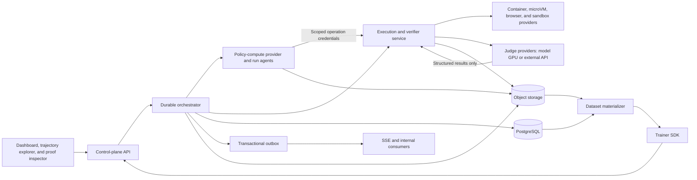
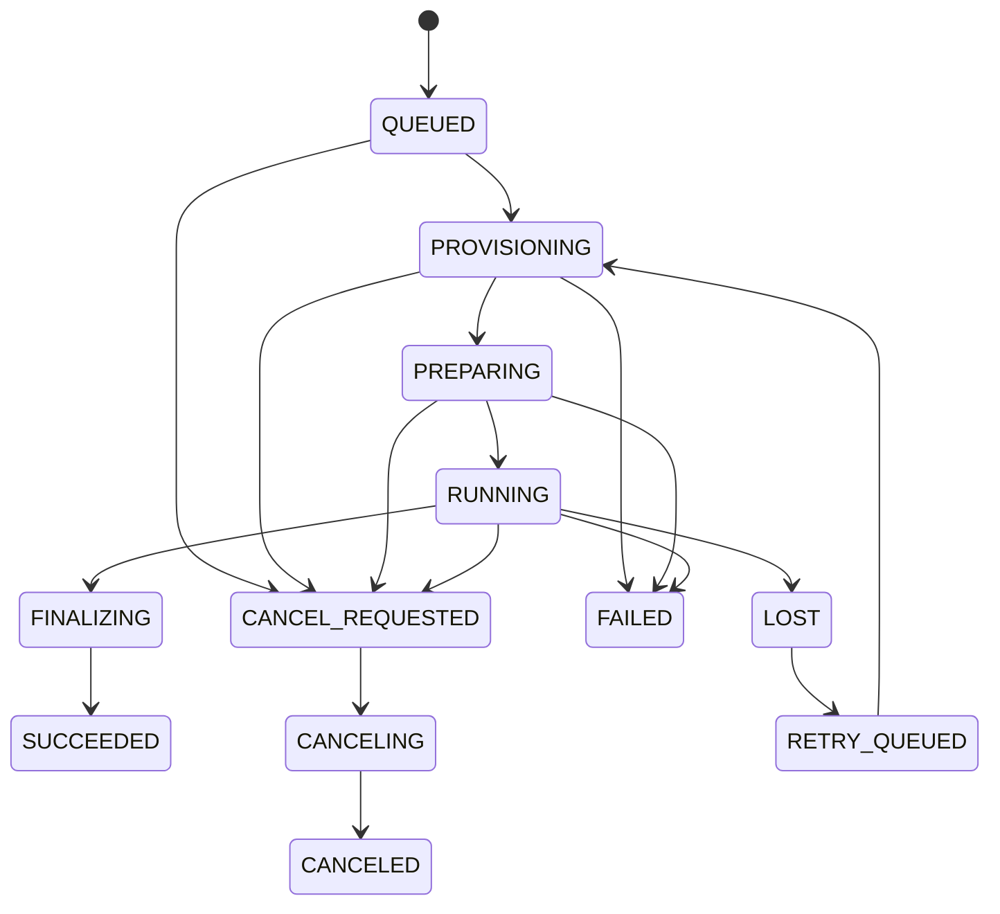
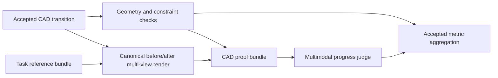
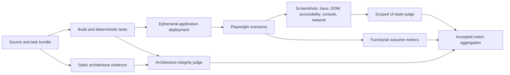

# Equinox Next

## Document control

| Field | Value |
|---|---|
| Product | Equinox |
| Document | Product and system specification |
| Version | 0.2 |
| Date | 26 July 2026 |
| Status | Draft for decision review |
| Primary users | RL researchers, environment authors, research operators |
| Initial deployment | Mac Studio control and verifier plane, RunPod policy workers, provider-neutral judge backends |
| Initial domains | CAD reconstruction first; software repositories, full-stack applications, and stateful tool tasks next |

This document defines the next generation of Equinox. It supersedes
[`prd.md`](prd.md) for new architecture work. The existing system may continue to run
experiments while the new system is built.

[`docs/consolidation-plan.md`](docs/consolidation-plan.md) describes stabilization and
consolidation of the current implementation. It does not set the architecture for
Equinox Next. Existing experiment reports remain valid research records.

## Contents

1. Product definition
2. Goals, non-goals, and users
3. Decisions at a glance
4. Canonical language and hierarchy
5. System architecture
6. Run and iteration lifecycle
7. Environment contract
8. Checkpoints, restoration, and branching
9. Execution and verifier service
10. Verification graphs, LLM judges, and reward
11. Trainer and algorithm integration
12. Durable data model
13. Public and internal APIs
14. Dashboard, trajectory explorer, and proof inspector
15. Security and integrity
16. Reliability, observability, and performance
17. Conformance suites
18. Reference environments
19. Research and comparison protocol
20. Delivery plan
21. Reuse and migration from the current repository
22. Acceptance levels and tests
23. Open decisions before implementation
24. Research basis
25. Glossary

## 1. Product definition

### 1.1 Product statement

Equinox is a branchable execution and evidence-based verification platform for
reinforcement learning over expensive, stateful, long-horizon environments.

Equinox lets a trainer:

1. Reach an intermediate environment state.
2. Capture a restorable checkpoint at a decision boundary.
3. Fork controlled counterfactual continuations from that checkpoint.
4. Execute those continuations on the appropriate sandbox and compute tier.
5. Run a versioned verification graph that produces immutable proof bundles.
6. Combine deterministic checks with calibrated multimodal LLM judges.
7. Preserve the lineage, evidence, uncertainty, cost, and versions behind every reward.
8. Reconstruct the exact examples that produced a policy update.

The first product wedge is multi-turn CAD reconstruction. Each accepted CAD state can be
rendered from controlled views and compared with the task reference by deterministic
geometry checks and a strong multimodal judge. The long-term target is substantially
longer software-engineering work: an agent builds a full-stack application while tests,
static analysis, Playwright scenarios, screenshots, traces, taste judges, and architecture
judges establish progress and final quality.

BPO is the first branch-aware algorithm customer. The orchestrator remains independent
of BPO-specific branch selection, credit assignment, and optimization so that independent
rollouts, RLOO, GRPO, PPO, offline learning, evaluation-only search, replay, and curricula
can consume the same branch and verification records.

### 1.2 Product thesis

Long-horizon agent work has two expensive assets that current RL loops usually discard:
restorable intermediate states and the evidence needed to understand whether those states
are improving.

Equinox turns both into durable research objects:

- an environment snapshot captures a reusable external-world state;
- a decision checkpoint binds that state to the policy context and continuation rules;
- a proof bundle captures what deterministic tools, renderers, browsers, and judges saw;
- a verification graph records how those inputs became metric observations; and
- a reward pipeline records how accepted observations became named reward signals.

Forking a checkpoint gives researchers controlled comparisons between actions from a
shared state. Re-running or reconfiguring a judge over a stored proof bundle can test a
new rubric or judge model without repeating the underlying CAD execution, browser run, or
test suite when the required evidence already exists.

An LLM judge is not ground truth and is not the reward. It is one stochastic verifier
step whose model, prompt, rubric, inputs, output schema, calibration status, uncertainty,
and failure mode are pinned and inspectable.

### 1.3 Product position

Equinox owns:

- versioned environment contracts;
- state capture, restoration, and fork execution;
- rollout and branch lineage;
- versioned verification plans and step orchestration;
- trusted proof-bundle production through renderers, browsers, tests, and analyzers;
- resource-aware scheduling across CPU, browser, render, model-GPU, and external-API
  backends;
- judge model, prompt, rubric, calibration, and invocation provenance;
- accepted verification evidence and named metric observations;
- training-data materialization;
- run durability and reproducibility; and
- the dashboard, trajectory explorer, and verification inspector.

Trainer plugins own:

- behavior-policy lifecycle;
- branch selection strategy;
- return and discount semantics;
- advantage estimation;
- tree-to-token or tree-to-action weighting;
- use of progress, terminal, pointwise, or pairwise signals;
- policy loss and optimization;
- reference-policy handling; and
- model checkpoints.

Environment plugins own:

- action and observation schemas;
- logical state serialization;
- transition execution;
- snapshot capabilities;
- termination rules;
- task-reference and hidden-input roles;
- verification-plan templates and trigger points;
- deterministic hard constraints;
- evidence producers and policy-visible feedback projections;
- artifact roles and viewer hints; and
- resource, network, and secret policies.

Judge-provider plugins own transport to a model backend and provider-specific usage
metadata. They do not define the scientific rubric, aggregate rewards, write rollout
lineage, or decide whether data enters a training update.

### 1.4 Product quality measures

No single throughput scalar describes product quality. V1 uses a small scorecard:

**Integrity**

- zero duplicate accepted transitions from retries;
- zero duplicate accepted policy commits;
- every committed training example has complete state, policy, verification, reward, and
  version provenance; and
- verifier or judge infrastructure failures never become candidate reward zero.

**Branch and verification runtime**

- eligible checkpoint-to-valid-four-way-fork success rate;
- restore-fidelity pass rate;
- verification-graph completion rate;
- judge abstention, disagreement, and invalid-output rates;
- branch setup, rendering, browser, judge, and end-to-end latency; and
- cost by shared prefix, suffix execution, proof production, and judging.

**Research value**

- cost-normalized policy improvement against matched independent rollouts;
- admitted training examples or tokens per dollar;
- useful branch-group yield per dollar; and
- judge agreement and calibration on held-out human-labeled cases.

Raw transition count, GPU utilization, and judge throughput remain operational
diagnostics rather than the primary scientific objective.

## 2. Goals, non-goals, and users

### 2.1 Product goals

Equinox Next must:

- run stateful multi-turn environments;
- preserve observation, logical state, runtime binding, policy context, and hidden
  verification inputs as separate concepts;
- fork an eligible checkpoint into isolated sibling continuations;
- execute a versioned verification graph after selected transitions, milestones,
  terminal states, or explicit submissions;
- support deterministic checks, evidence producers, browser scenarios, sandboxed tests,
  multimodal LLM judges, and deterministic aggregation as first-class verifier steps;
- compare a task reference, source state, and candidate state through immutable proof
  bundles;
- support pointwise, pairwise, and branch-group judging without exposing branch identity
  or policy identity to the judge;
- route compute-heavy work through a verifier plane without tying its lifecycle to a web
  process or assuming that every verifier is CPU-only;
- keep policy failures, environment outcomes, verifier operational failures, judge
  abstentions, and candidate-quality results distinct;
- retain the evidence and uncertainty behind each reward;
- pin behavior-policy, judge-model, prompt, rubric, renderer, browser, verifier, and reward
  versions;
- survive API, orchestrator, policy worker, execution worker, browser worker, and judge
  provider restarts or outages;
- expose the real rollout trees and verification graphs that produced each training
  iteration;
- compare branching and independent rollouts under a multidimensional budget that
  includes judge usage and proof-production cost;
- rejudge stored proof bundles when a new judge or rubric needs no new underlying
  evidence;
- export portable sequential data with branch and verification lineage; and
- test each environment, verifier plan, provider, and judge specification against the
  applicable conformance suites.

### 2.2 Research goals

The first research program must answer:

- Does a sibling comparison from one restored state reduce useful gradient variance?
- Which branch selection strategies work across task types?
- Which environment RNG mode gives the intended counterfactual?
- How do branch width and branch depth affect learning and cost?
- Which credit estimators remain useful when siblings fail or arrive late?
- Does per-transition multimodal CAD judging provide useful progress signal beyond
  terminal geometry checks?
- Are sibling-relative pairwise judgments more stable than separately scored pointwise
  rewards?
- How much do judge model, prompt, order, rubric decomposition, and sampling affect the
  resulting policy update?
- Which uncertainty or disagreement thresholds should abstain rather than manufacture a
  scalar?
- How quickly does a policy learn to exploit blind spots in deterministic and LLM
  verifiers?
- Does state reuse help beyond BPO through replay, curricula, or search?

Equinox must preserve enough data to change the estimator, reward pipeline, or judge
configuration after collection. Researchers should not rerun candidate execution,
rendering, browser scenarios, or deterministic verification merely because the first
reward transform was wrong. A new verifier that needs evidence not previously captured
may still require new proof production.

### 2.3 Non-goals for v1

Version 1 does not include:

- recursive branch-from-branch execution;
- token-prefix branching inside model generation;
- asynchronous learning across stale policy versions;
- automatic environment generation;
- an environment marketplace;
- a general-purpose workflow engine;
- a public multi-tenant SaaS;
- a new RL framework;
- treating an LLM judge as ground truth;
- replacing tests, geometry constraints, or other deterministic hard gates with an LLM;
- allowing a judge to execute tools or browse from candidate-controlled input;
- a universal aesthetic or architecture rubric that works without task-specific
  calibration;
- a claim that BPO beats every independent-rollout baseline; or
- a universal microVM backend.

The data model may leave room for later features. The v1 runtime must reject unsupported
operations instead of silently approximating them.

### 2.4 Primary users

#### Research operator

The operator launches runs, watches execution and verifier cost, inspects failed work,
compares experiments, cancels runs, and reproduces prior manifests.

#### RL researcher

The researcher implements branch strategies and credit estimators, consumes immutable
rollout trees and verification records, and links each optimizer update to the data that
caused it.

#### Environment author

The author packages a stateful task, declares schemas and capabilities, implements state
save and restore, defines verification triggers and proof-bundle roles, and passes the
conformance suite.

#### Verification designer

The verification designer defines deterministic gates, evidence-producing steps, judge
rubrics, policy-visible feedback, calibration packs, abstention rules, and reward-pipeline
inputs. This role may be held by the environment author in a small team.

#### Platform developer

The developer adds compute and judge providers, maintains the orchestrator and execution
service, and investigates performance, calibration, integrity, or recovery failures.

## 3. Decisions at a glance

| ID | Area | Decision |
|---|---|---|
| EQX-001 | Product boundary | Build a branchable execution and evidence-based verification platform with trainer plugins |
| EQX-002 | System of record | The orchestrator owns accepted scientific run state and lineage |
| EQX-003 | Metadata store | Use PostgreSQL in production |
| EQX-004 | Artifact store | Use content-addressed S3-compatible object storage |
| EQX-005 | Events | Use typed append-only events with a transactional outbox |
| EQX-006 | Live UI | Use cursor-based SSE, with polling as fallback |
| EQX-007 | Policy compute provider | Support RunPod first through a provider interface |
| EQX-008 | Policy process | Run a detached, reconnectable run agent on the policy allocation |
| EQX-009 | Verifier plane | Expose stateful sessions and asynchronous verification graphs across typed resource classes |
| EQX-010 | Initial verifier host | Use the Mac Studio through a provider-neutral execution and verifier service |
| EQX-011 | Environment packaging | Use an OCI image plus a versioned manifest and schemas |
| EQX-012 | Snapshot model | Separate reusable environment snapshots from policy-specific decision checkpoints |
| EQX-013 | Branch topology | Support one backbone branch point with one-level sibling groups in the first path |
| EQX-014 | Algorithm ownership | Trainer plugins define branch selection, credit assignment, and optimization |
| EQX-015 | Failure semantics | Separate policy decisions, execution operations, semantic transitions, verifier attempts, and judge outcomes |
| EQX-016 | Reward model | Store proof, accepted metrics, and named signals before deriving a scalar reward |
| EQX-017 | Reproducibility | Pin source, images, models, tasks, environments, verifiers, judges, prompts, rubrics, configs, seeds, and hardware |
| EQX-018 | Generic UI | Render typed artifacts and proof graphs through a fixed viewer registry |
| EQX-019 | Local development | Local substitutes may exist, but their actual fidelity and judge behavior must be declared |
| EQX-020 | Tenancy | Ship a single-user v1 with project and ownership fields in the schema |
| EQX-021 | Verification model | Represent verification as a versioned DAG of deterministic, evidence-producing, browser, judge, and aggregation steps |
| EQX-022 | LLM judge | Treat an LLM judge as stochastic evidence, never as the reward or an unquestioned oracle |
| EQX-023 | Judge integrity | Treat all candidate-controlled text, source, DOM, and pixels as untrusted prompt-injection surfaces |
| EQX-024 | CAD first path | Verify each accepted CAD state with canonical renders, geometry checks, and a multimodal judge; use group judging at the branch point |
| EQX-025 | Software north star | Use tests, static architecture evidence, Playwright proof bundles, taste judges, and architecture judges for full-stack tasks |
| EQX-026 | Local judge | Use a deterministic mock judge for local acceptance and an explicit opt-in provider for real strong-model research runs |

## 4. Canonical language and hierarchy

Equinox must avoid `step` as a canonical database entity. Existing systems often use the
word for both an optimizer update and an environment action.

Collection and optimization have different lifecycles. A rollout tree is collected under
one behavior-policy and verification context; a training iteration consumes an immutable,
versioned selection of those trees.

```text
Project
└── Run
    └── RunAttempt
        ├── PolicyVersion
        ├── CollectionBatch
        │   └── RolloutTree
        │       ├── Rollout
        │       ├── State
        │       ├── PolicyDecision
        │       ├── Transition
        │       ├── BranchGroup
        │       │   └── BranchMember
        │       └── VerificationRun
        │           ├── VerifierStepRun
        │           ├── EvidenceBundle
        │           └── JudgeInvocation
        └── TrainingIteration
            ├── IterationInput
            ├── EligibilityDecision
            ├── RewardSignal references
            └── output PolicyVersion
```

| Term | Definition |
|---|---|
| Run | Immutable scientific intent and normalized launch manifest |
| RunAttempt | One execution attempt for a run |
| CollectionBatch | A versioned collection window under a pinned behavior-policy and verification context |
| TrainingIteration | One policy-update boundary with immutable inputs and one accepted output policy version |
| IterationInput | Manifest naming the exact rollout trees, eligibility decisions, weights, rewards, and materializer used by an iteration |
| RolloutTree | One task reset and its shared branching history |
| Rollout | One root-to-leaf continuation through a rollout tree |
| State | One immutable semantic environment boundary before a policy decision |
| Observation | The policy-visible projection of a state |
| RuntimeCursor | An operational session binding that points at a current state and runtime instance |
| PolicyDecision | Policy context, sampling metadata, action output, and behavior metadata |
| Action | The typed command proposed by the policy |
| Transition | Accepted semantic execution of an action from one state to another |
| EnvironmentSnapshot | Reusable environment state captured at a declared fidelity level |
| DecisionCheckpoint | A run- and policy-specific branch point that binds a snapshot, policy context, RNG, lineage, horizon, and resource reservation |
| BranchGroup | A requested sibling set from one decision checkpoint |
| BranchMember | One sibling continuation and its role in a branch group |
| VerificationPlan | Immutable DAG that declares verifier steps, inputs, dependencies, resource profiles, and acceptance rules |
| VerificationRun | One execution of a verification plan against a state, transition, branch group, rollout, or submission |
| VerifierStep | One typed node in a verification plan |
| EvidenceBundle | Immutable manifest of artifacts and metadata supplied to later verifiers or judges |
| JudgeSpec | Versioned model, prompt, rubric, schema, sampling, calibration, and abstention contract |
| JudgeInvocation | One model call attempt against an immutable judge-input manifest |
| JudgeResult | Parsed per-criterion assessment, preference, uncertainty, abstention, explanation, and evidence citations |
| MetricObservation | Accepted typed measurement derived from a verifier step before reward transformation |
| RewardSignal | A named scalar derived by a versioned reward pipeline |

The UI may label a training iteration as an "iteration." It may label a transition as an
"action" when that term reads better for the environment. It must label LLM output as a
model judgment rather than a fact.

## 5. System architecture



### 5.1 Dashboard

The dashboard:

- calls the public orchestrator API;
- reads signed artifact URLs;
- subscribes to the run event stream;
- stores no scientific state;
- launches runs from typed templates;
- presents operational, research, and verification views;
- links each training iteration to its source rollout trees; and
- shows the exact verification graph, proof bundle, judge version, uncertainty, and reward
  transform behind a selected signal.

The dashboard does not manage pods, parse trainer logs into metrics, invoke judges,
render hidden targets, expose hidden rubrics, or write trajectory rows.

### 5.2 Orchestrator

The orchestrator acts as the sole authority for accepted scientific facts:

- run manifests and lifecycle;
- run attempts and collection batches;
- policy versions and training iterations;
- rollout, state, transition, and branch lineage;
- operation authorization and correlation;
- budget admission, reservations, and accounting;
- policy-compute allocation desired state;
- cancellation and retry policy;
- verification-plan selection and accepted verification results;
- training eligibility;
- durable event ingestion;
- artifact metadata;
- snapshot and decision-checkpoint publication; and
- finalization.

The orchestrator does not execute candidate code, import CAD packages, run tests, drive a
browser, render artifacts, call an LLM judge directly, or define an RL loss.

The execution and verifier service may produce operational facts and immutable artifacts.
Only the orchestrator accepts those results into scientific `State`, `Transition`,
`VerificationRun`, `MetricObservation`, and iteration lineage.

### 5.3 Policy run agent

The run agent runs inside the policy-compute allocation and:

- starts from an immutable run bundle;
- loads the trainer and behavior policy;
- publishes heartbeats;
- creates collection batches and proposes training iterations;
- submits or authorizes rollout work;
- submits branch and verification plans;
- emits typed metrics and events;
- publishes model and optimizer checkpoints;
- honors cancellation; and
- reconnects after control-plane restarts.

An SSH session may bootstrap or debug the agent. The SSH process must not own the run
lifecycle.

### 5.4 Execution and verifier service

The service owns operational execution:

- session and sandbox lifecycle;
- environment image and workload-profile resolution;
- actions against stateful sessions;
- snapshot, restore, fork, and fidelity probes;
- verification-plan DAG execution;
- CPU, browser, render, static-analysis, hidden-test, and judge job queues;
- judge-provider invocation through a typed adapter;
- leases, heartbeats, retries, timeouts, and fencing;
- resource, network, and trust enforcement;
- proof-bundle assembly;
- artifact upload;
- operational capacity data; and
- orphan reconciliation.

The service records provider handles, attempts, and operational results in its own store.
It does not create scientific rollout lineage, scalar rewards, or policy commits.

### 5.5 Judge providers

A judge provider converts an immutable `JudgeInvocationRequest` into a raw model response
and usage record. Backends may be:

- a frontier multimodal model reached through an external API;
- a model hosted on a dedicated verifier GPU pool;
- a smaller local model used for screening or ablations; or
- a deterministic mock used by local acceptance tests.

The provider adapter must report the model identifier returned by the backend, any
available snapshot or system fingerprint, latency, token or image usage, cost, refusal or
safety status, and retry metadata. Provider aliases that cannot be pinned lower the
reproducibility level of the result.

Judge providers receive no candidate credentials, orchestration credentials, tools, or
network authority beyond the model invocation itself.

### 5.6 Data-plane rule

Large payloads move through object storage. The orchestrator passes artifact references
and signed credentials, not meshes, images, Playwright traces, source trees, or model
checkpoints in API payloads.

A proof bundle is an immutable manifest of content-addressed inputs. A judge invocation
references that manifest and a `JudgeSpec`; it does not embed arbitrary candidate bytes
inside a control-plane request.

The trainer may submit high-volume execution or verification work with short-lived,
operation-scoped credentials. The orchestrator must record the intent before issuance and
remain the authority for the one accepted result.

## 6. Run and iteration lifecycle

### 6.1 Run manifest

A run manifest must pin the collection, verification, and reward context:

```yaml
project_id: project-equinox
environment:
  id: cad.reconstruction
  version: "1.0.0"
  image_digest: "sha256:..."
task_pack:
  id: cad-reference
  revision: "sha256:..."
algorithm:
  id: bpo-local
  version: "0.1.0"
trainer:
  image_digest: "sha256:..."
model:
  revision: "..."
  tokenizer_revision: "..."
policy_compute:
  provider: runpod
  resource_profile: a100-80gb
execution:
  provider: studio
  profile: cad-default
branch:
  strategy: fixed-boundary
  width: 4
  max_backbone_points: 1
verification:
  plan_id: cad.transition-composite@1
  triggers:
    - after-transition
    - terminal
  judge_spec_id: cad.multimodal-progress@1
  branch_group_judge_spec_id: cad.sibling-pairwise@1
  required_calibration_status: production-ready
budgets:
  policy_input_tokens: 1000000
  policy_output_tokens: 250000
  policy_gpu_seconds: 36000
  environment_cpu_seconds: 72000
  render_cpu_seconds: 36000
  browser_cpu_seconds: 0
  verifier_cpu_seconds: 72000
  judge_input_tokens: 3000000
  judge_output_tokens: 300000
  judge_external_cost: 1000.00
  wall_clock_seconds: 86400
  transitions: 10000
retention:
  class: research
seed_manifest:
  run_seed: 1234
```

The API normalizes the manifest before launch. The normalized form receives a digest and
does not change after creation.

A local profile may replace the policy provider and judge provider with deterministic
mocks. The normalized manifest must make that substitution explicit; local evidence must
not be labeled as frontier-model judgment.

### 6.2 Run and attempt states



A `Run` keeps scientific intent. A `RunAttempt` records one execution. A retry creates a
new attempt under the same run.

The run records a separate scientific outcome and cleanup outcome. A successful training
result can coexist with a leaked-allocation alert until reconciliation releases the
resource.

### 6.3 Collection and training-iteration states

A collection batch moves through:

```text
PLANNED
  -> COLLECTING
  -> VERIFYING
  -> READY_FOR_MATERIALIZATION
  -> CLOSED
```

A training iteration consumes already accepted collection records:

```text
PLANNED
  -> MATERIALIZING
  -> OPTIMIZING
  -> COMMITTING
  -> COMMITTED
```

Each iteration stores:

- input behavior-policy version;
- reference-policy version when used;
- immutable iteration-input manifest;
- rollout trees admitted to the update;
- excluded trees and reasons;
- verification-plan, judge-spec, and reward-pipeline versions used by those trees;
- estimator and loss configuration;
- optimizer inputs and immutable output artifacts;
- output policy version;
- metrics and budget deltas; and
- a commit operation ID.

Only `COMMITTED` advances the current policy version. The orchestrator accepts one policy
successor through compare-and-swap against the expected input policy. A trainer may have
performed redundant compute, but a retry must not create a second accepted successor.

### 6.4 Cancellation

The run API supports:

- `checkpoint_then_cancel(max_wait, fallback)`;
- `finish_iteration_then_cancel(max_wait, fallback)`; and
- `terminate`.

Cancellation sets desired state. The run agent, execution and verifier service, judge
invocation manager, and provider reconcilers observe it. Deleting a pod, browser, session,
or VM does not count as cancellation.

Cancellation releases live sessions, leases, provider handles, reserved capacity, and
unpinned ephemeral snapshot bytes. It preserves scientific checkpoint metadata, accepted
proof bundles, verification attempts, judge results, and cleanup failures according to
the retention policy.

### 6.5 Finalization and provenance

Each run template declares required final artifacts. A training run should require:

- normalized run manifest;
- complete entity and event lineage;
- final metric summary;
- last committed model checkpoint;
- optimizer checkpoint when resume is supported;
- training dataset materialization manifests;
- required proof bundles and accepted verification results;
- judge invocation manifests, parsed results, and calibration references;
- reward-pipeline outputs used by committed iterations; and
- artifact digests.

The orchestrator marks scientific success after these artifacts commit. Allocation and
sandbox cleanup continues under its own state and can surface a warning without changing
the scientific result.

A run attempt records:

- source commit and immutable source-bundle digest, including a dirty diff when present;
- trainer, environment, execution, renderer, browser, verifier, and judge-adapter image
  digests;
- model, tokenizer, task-pack, judge-model, prompt, rubric, reward-pipeline, and
  calibration revisions;
- normalized configuration;
- all seed manifests;
- provider and hardware class;
- runtime, browser, font, graphics, and driver versions where relevant; and
- input and output policy versions.

The `reproduce` command creates a new run linked to the source manifest. It promises an
auditable replay, not bitwise-identical model judgments or GPU outputs unless the
manifest explicitly declares and passes that stronger reproducibility level.

## 7. Environment contract

### 7.1 Environment package

An environment version consists of:

- an immutable manifest;
- an OCI image digest;
- action, observation, logical-state, and result schemas;
- a task-pack contract with public, reference, and hidden artifact roles;
- save, restore, and digest hooks;
- termination and truncation rules;
- verification-plan specifications;
- proof-bundle schemas;
- policy-visible feedback projections;
- artifact roles and viewer hints;
- resource limits;
- network and secret policies;
- declared snapshot capabilities;
- supported RNG fork modes; and
- conformance results.

Illustrative CAD manifest:

```yaml
environment_id: cad.reconstruction
version: "1.0.0"
runtime_image_digest: "sha256:..."
schemas:
  action: "artifact://schemas/cad-action-v1.json"
  observation: "artifact://schemas/cad-observation-v1.json"
  logical_state: "artifact://schemas/cad-state-v1.json"
reset_modes:
  - clean-task
snapshot_capabilities:
  - logical_restore
  - filesystem_restore
fork_rng_modes:
  - clone_stream
  - split_stream
termination_conditions:
  - submitted
  - solved
  - turn-limit
default_budgets:
  turns: 40
  cpu_seconds: 1800
verification_plans:
  - cad.transition-composite@1
  - cad.terminal-composite@1
verification_triggers:
  - after-transition
  - terminal
evidence_producers:
  - cad.canonical-render@1
  - cad.geometry-report@1
artifact_viewers:
  - image-comparison
  - mesh-3d
  - geometry-report
network_policy: disabled
secrets_policy: none
determinism_claim: logical-state-deterministic-under-seed
```

### 7.2 Required operations and scientific authority

The environment runtime implements operational commands:

```text
create_session(environment_version, task_revision, seed, task_horizon)
reset(session_id, operation_id)
apply_action(session_id, expected_state_id, action, operation_id)
capture_snapshot(session_id, source_state_id, requested_fidelity, operation_id)
restore_snapshot(snapshot_id, rng_mode, operation_id)
fork_checkpoint(decision_checkpoint_id, child_specs, operation_id)
run_verification(subject_ref, verification_plan_id, operation_id)
cancel(operation_id)
close_session(session_id, operation_id)
```

The execution service returns typed operational results and artifact references. It does
not return already committed scientific identifiers.

The acceptance sequence is:

1. The orchestrator records an operation intent, expected source state, budget
   reservation, and authorization digest.
2. The execution service performs the idempotent operation and stores output artifacts.
3. The service records attempts and emits an operational completion result.
4. The orchestrator verifies authorization, digests, expected state, budget, and result
   schema.
5. The orchestrator accepts the result exactly once and creates scientific states,
   transitions, verification runs, metric observations, or checkpoints.

A direct trainer-to-execution path must use a short-lived operation token binding the
operation ID, run attempt, source state, expected state version, workload profile,
verification plan, budget reservation, expiry, and request digest.

### 7.3 Outcome model

Equinox does not mix policy, infrastructure, environment, or verifier outcomes in one
transition enum.

**Policy decision outcome**

```text
COMPLETED
ABORTED
TIMED_OUT
INVALID_OUTPUT
CANCELED
```

**Execution operation outcome**

```text
SUCCEEDED
INFRA_FAILED
TIMED_OUT
CANCELED
```

**Semantic environment transition outcome**

```text
CONTINUED
TERMINATED
TRUNCATED
INVALID_ACTION
```

**Verifier-step outcome**

```text
SUCCEEDED
CANDIDATE_FAILED
ABSTAINED
INVALID_RESULT
VERIFIER_FAILED
INFRA_FAILED
TIMED_OUT
CANCELED
INTEGRITY_VIOLATION
```

`CANDIDATE_FAILED` means the verifier ran correctly and established a valid negative
result, such as a failed test or violated geometry constraint. `VERIFIER_FAILED` means the
verification mechanism itself failed. A successful judge may produce a low score or a
tie; a provider failure, malformed response, low-confidence abstention, or detected
prompt-injection attempt is not candidate reward zero.

A scientific `Transition` exists only after a semantic action result is accepted. A
policy that produced no action and infrastructure that produced no semantic result create
operational records, not fake transitions.

### 7.4 State, runtime, and proof model

Equinox separates:

- **Observation:** data available to the policy.
- **Logical state:** serialized task state needed for semantic restoration.
- **State:** immutable semantic boundary containing the logical-state and observation
  digests, environment and task versions, and semantic terminal status.
- **RuntimeCursor:** operational session, runtime instance, lease, fencing token, and
  current state pointer.
- **Runtime snapshot:** provider data used to restore execution efficiently.
- **Policy context:** model input, hidden state, conversation, tools, and sampling data.
- **Verification inputs:** task references, hidden inputs, rubrics, invariants, and
  trusted evidence not visible to the policy.
- **Evidence bundle:** immutable artifacts and transformations supplied to later verifier
  steps.

An initial reset creates a first-class semantic state and a runtime cursor pointing to it.
After a fork, sibling cursors may point to the same source state while holding separate
session IDs, runtime identities, leases, RNG derivations, and resource reservations.

Every action, observation, render, source bundle, browser trace, and verifier output
receives a canonical artifact reference. Hash-only records do not satisfy replay or
inspection requirements.

An environment may request verification after each accepted transition, at declared
milestones, at termination, or on explicit submission. A render or Playwright run blocks
training only when the selected verification plan declares it as required evidence.

### 7.5 Idempotency and concurrency

Each mutating operation includes:

- a caller-generated `operation_id`;
- an idempotency key;
- a canonical request digest;
- an expected aggregate or state version; and
- correlation identifiers.

A repeated key with a different request digest returns a conflict. A repeated key with
the same digest returns the prior accepted result.

Stateful commands use `expected_state_id`. The execution service rejects concurrent
actions against the same runtime cursor unless the environment declares a safe concurrent
operation.

A successful judge invocation is stored before acceptance and must not be reinvoked on a
normal retry. When a provider times out after possibly accepting a request and offers no
provider idempotency key, Equinox may record multiple invocation attempts and costs, but
the orchestrator accepts at most one result for the scientific verifier step.

Equinox uses recoverable sagas across services. It does not require a distributed database
transaction.

## 8. Checkpoints, restoration, and branching

### 8.1 Environment snapshots and decision checkpoints

A reusable `EnvironmentSnapshot` binds:

- source state ID;
- environment and task revisions;
- logical-state artifact and schema version;
- logical-state digest;
- runtime snapshot operation and provider handle when present;
- runtime image and obtained fidelity level;
- fidelity-probe result;
- environment RNG state or replay stream; and
- creation provenance.

A run-specific `DecisionCheckpoint` binds:

- environment snapshot ID;
- source transition and rollout-tree lineage;
- policy-context artifact;
- behavior-policy version;
- tokenizer, prompt template, and tool-schema versions;
- sampling configuration;
- policy RNG state;
- remaining semantic task horizon;
- branch strategy and selection information set; and
- explicit resource-budget reservations.

This split allows a semantic environment snapshot to become a later replay or curriculum
asset without pretending that its original policy context, budget ledger, or on-policy
status still applies.

The snapshot operation and snapshot bytes are separate records. Two operations may
produce the same content digest while retaining distinct provenance.

### 8.2 Fidelity levels

| Level | Guarantee |
|---|---|
| Logical restore | Restore a semantically equivalent task state |
| Filesystem restore | Restore files and persisted service state |
| Process restore | Restore process memory and open runtime context |
| Full runtime restore | Restore a microVM or equivalent boundary |
| Exogenous replay | Reproduce recorded external events, clocks, and randomness |

An environment declares its supported levels. A snapshot records the level obtained, not
the level requested.

Every production snapshot runs an environment-supplied probe. A live VM or container
without a matching semantic state digest does not pass.

### 8.3 RNG fork modes

| Mode | Semantics |
|---|---|
| `clone_stream` | Each child begins from the same environment RNG state |
| `split_stream` | Each child receives a deterministic stream derived from the parent |
| `fresh_entropy` | Each child receives new nondeterministic entropy |
| `replay_recorded` | Each child consumes a recorded external event stream |

Policy sampling RNG remains separate from environment RNG.

`clone_stream` guarantees only the same initial PRNG state. It is a paired counterfactual
only when action-dependent code does not consume different random draws or when the
environment uses counter-based or event-keyed randomness. The environment conformance
result must state the stronger semantics, if any.

### 8.4 Branch plan

The trainer submits a versioned branch plan:

```json
{
  "strategy_id": "fixed-boundary@1",
  "source_state_id": "state-...",
  "decision_checkpoint_id": "checkpoint-...",
  "width": 4,
  "topology": "backbone-side-branches",
  "selection_mode": "precommitted",
  "selection_inputs_artifact": "artifact-...",
  "environment_rng_mode": "clone_stream",
  "policy_sampling_mode": "independent",
  "behavior_policy_version_id": "policy-...",
  "verification_plan_id": "cad.transition-composite@1",
  "judge_spec_id": "cad.multimodal-progress@1",
  "group_judge_spec_id": "cad.sibling-pairwise@1",
  "member_task_horizon": {"turns_remaining": 12},
  "member_resource_limits": {
    "policy_tokens": 20000,
    "environment_cpu_seconds": 600,
    "render_cpu_seconds": 120,
    "judge_input_tokens": 30000
  },
  "completion_rule": "all-members",
  "failure_rule": "retry-then-exclude",
  "deadline_at": "..."
}
```

The orchestrator validates the plan, reserves aggregate resource budget, and asks the
execution service to fork. It does not compute entropy, judge scores, or advantages.

A strategy that chooses a branch point after observing later backbone outcomes must mark
`selection_mode: retrospective`, preserve the eligible-state set and selection inputs,
and disclose future information used. Same-policy collection does not remove selection
bias.

### 8.5 Initial topology

The first branch-aware path supports:

- one backbone rollout per rollout tree;
- one branch point on that backbone;
- the backbone continuation as sibling index 1 when requested;
- `K - 1` restored continuations;
- width four; and
- terminal or truncated outcomes for each sibling.

The runtime rejects branch points created inside a side continuation. Multiple backbone
points and recursive branches are later milestones.

### 8.6 Sibling consistency and group judging

A trainable sibling group must pin:

- one decision checkpoint;
- one behavior-policy version;
- one policy-context digest;
- one tokenizer and prompt template;
- one sampling configuration except member RNG seeds;
- one environment and task revision;
- one verification plan;
- one pointwise judge specification when used;
- one branch-group judge specification when used;
- one reward-pipeline version;
- one task-horizon policy;
- explicit member resource limits; and
- one branch-strategy version.

Pointwise judging scores each continuation against the same task reference and source
state. Pairwise or group judging compares siblings under randomized, blinded presentation
order and may emit preferences, ties, a ranking, or an abstention. The trainer chooses how
to use those signals.

Policy updates cannot occur while the trainer constructs a strict same-version group.
Duplicate sampled actions remain valid samples.

### 8.7 Failure and admission rules

Infrastructure retries remain attempts of the same branch member and logical operation.
They must use the original policy, environment, verification, judge, and reward versions.

The default initial rule:

1. Retry retryable execution, browser, renderer, and judge-provider failures within the
   member deadline.
2. Accept declared policy timeouts as terminal or truncated outcomes only when the
   environment defines that semantic.
3. Treat judge abstention, disagreement above threshold, malformed output, and integrity
   violations according to the versioned verification plan; do not convert them to zero.
4. Exclude the group when a required member lacks a valid admitted outcome.
5. Retain all attempts, costs, evidence, abstentions, and exclusion reasons.

Training eligibility is a versioned decision record. It does not overwrite trajectory or
verification facts with a mutable boolean.

### 8.8 Budget semantics

Semantic task horizon and resource budget are separate.

Each child receives a copy of the declared semantic horizon, such as turns remaining and
an environment deadline. Before the fork, the orchestrator reserves the aggregate maximum
resource budget across all members, including policy, environment, rendering, browser,
verification, judge, retry, and artifact costs. Forking never refreshes a run-level
resource budget.

Equinox records:

```text
policy_input_tokens
policy_output_tokens
policy_gpu_seconds
environment_cpu_seconds
environment_gpu_seconds
render_cpu_seconds
browser_cpu_seconds
verifier_cpu_seconds
judge_input_tokens
judge_output_tokens
judge_model_seconds
judge_external_cost
wall_clock_seconds
transitions
terminal_rollouts
snapshots_created
snapshot_bytes_written
snapshot_bytes_restored
artifact_bytes
external_service_cost
retry_cost
```

Reports separate shared-prefix cost, snapshot cost, sibling suffix cost, proof-production
cost, and judge cost. Equal leaf counts do not imply equal compute or equal information.

## 9. Execution and verifier service

### 9.1 Service surfaces

The service exposes related operational APIs.

#### Stateful environment API

```text
POST /v1/sessions
GET  /v1/sessions/{session_id}
POST /v1/sessions/{session_id}/actions
POST /v1/sessions/{session_id}/snapshots
POST /v1/snapshots/{snapshot_id}/restores
POST /v1/decision-checkpoints/{checkpoint_id}/forks
POST /v1/sessions/{session_id}/cancel
POST /v1/sessions/{session_id}/close
```

#### Verification API

```text
POST /v1/verification-runs
GET  /v1/verification-runs/{verification_run_id}
GET  /v1/verification-runs/{verification_run_id}/steps
GET  /v1/verifier-step-runs/{step_run_id}
GET  /v1/jobs/{job_id}
GET  /v1/jobs/{job_id}/events
POST /v1/jobs/{job_id}/cancel
GET  /v1/capacity
GET  /v1/profiles
```

Judge-provider APIs are internal to the service. The public control plane exposes accepted
judge results and proof metadata, not provider credentials.

### 9.2 Job and attempt model

An `ExecutionJob` represents one logical operational request. An `ExecutionAttempt`
records one lease, sandbox, provider invocation, and retry.

```text
SUBMITTED
  -> LEASED
  -> PREPARING
  -> RUNNING
  -> UPLOADING
  -> SUCCEEDED
```

Alternative outcomes:

```text
CANDIDATE_FAILED
ABSTAINED
INTEGRITY_VIOLATION
INFRA_FAILED -> RETRY_PENDING
TIMED_OUT
CANCELED
```

The service keeps the logical job ID across retries. The orchestrator accepts one result
for the operation. Every attempt and its cost remain visible.

### 9.3 Workload profiles

The service runs registered profiles instead of arbitrary shell commands.

Examples:

```text
cadquery.execute@1
cad.geometry-verify@1
cad.canonical-render@1
image.pixel-compare@1
image.perceptual-compare@1
judge.multimodal-rubric@1
judge.branch-pairwise@1
software.build@1
software.hidden-tests@1
software.static-architecture@1
software.playwright-e2e@1
software.proof-bundle@1
judge.ui-taste@1
judge.software-architecture@1
stateful.crm-actions@1
```

Each profile pins:

- image, browser bundle, or model-adapter digest;
- accepted input and output schemas;
- resource class, defaults, and ceilings;
- network and dependency policy;
- determinism, stochasticity, and caching policy;
- snapshot support when relevant;
- output artifact roles;
- renderer, browser, verifier, or judge-adapter versions;
- trust class; and
- policy for exposing feedback to the agent.

### 9.4 Trust classes

The service separates:

#### Public candidate execution

Runs candidate code with public task assets. It cannot access hidden targets, judge
rubrics, calibration cases, or verifier secrets.

#### Trusted evidence production

Runs renderers, analyzers, browsers, and artifact-level checks against immutable candidate
outputs and trusted task inputs. It avoids executing candidate source when a safer
artifact-level check exists.

#### Hidden-test execution

Runs candidate code against hidden tests when required. This profile needs a specific
threat model because candidate code and hidden assets share a runtime boundary.

#### Isolated judge orchestration

Builds a minimal judge-input manifest from approved evidence roles, invokes the selected
model without tools, and validates the structured output. Candidate-controlled text,
source, DOM, and pixels remain untrusted data. The judge receives no writable access to
candidate or control-plane systems.

The UI process does not load hidden catalogs, invoke hidden verifiers, or run lazy render
work.

### 9.5 Scheduling and capacity

The verifier plane is a logical scheduling domain, not a claim that all verification is
CPU-only. The scheduler supports resource classes such as:

```text
sandbox-cpu
sandbox-gpu
render-cpu
render-gpu
browser
model-gpu
external-model-api
```

It must support:

- CPU, GPU, memory, disk, browser, VM, process, token, request-rate, and cost limits;
- fair share across runs;
- priority classes for interactive and training work;
- admission control and backpressure;
- warm pools by environment and browser version;
- snapshot-local placement;
- external judge-provider quotas and circuit breakers;
- straggler deadlines;
- cancellation propagation;
- sandbox recycling and quarantine; and
- queue and capacity reporting.

The trainer should not block expensive policy compute on one monolithic verifier request.
Verification plans expose step-level progress and can run independent nodes concurrently.

### 9.6 Caching

V1 may cache:

- deterministic verification by candidate, task, and verifier digests;
- rendering by state, renderer, camera, material, lighting, and size digests;
- browser proof production by source bundle, scenario, browser image, viewport, locale,
  timezone, font bundle, and dependency digests;
- immutable preprocessing transforms; and
- an accepted judge invocation by the exact proof-bundle, judge-model, prompt, rubric,
  schema, sampling, and sample-index manifest.

A request for an additional stochastic judge sample receives a distinct sample index and
is not a cache hit for the prior sample.

V1 does not cache state-mutating environment actions. The service never caches
infrastructure or verifier failures. A cache hit still creates an attempt record for
cost, lineage, and provenance.

### 9.7 Initial Studio deployment

The Mac Studio hosts the first execution and verifier service. Local sessions use a
Docker-backed provider and declare logical or filesystem restore honestly. The local
acceptance profile uses a deterministic mock judge and must not contact a real model
provider.

A separate research profile may route judge steps to a strong multimodal model and policy
compute to RunPod. That profile is explicit, credentialed, budgeted, and outside the
local acceptance flow.

The team must select a production isolation provider through a bounded spike that
measures guest compatibility, fidelity, restore latency, copy-on-write behavior, resource
limits, secret and identity rehydration, operational recovery, and integration complexity.
The architecture does not assume Firecracker can run directly on macOS.

## 10. Verification graphs, LLM judges, and reward

### 10.1 Verification principles

Verification is a versioned computation over immutable evidence. It is not a synchronous
`score()` call and it does not begin with a scalar.

The default ordering is:

```text
candidate execution
  -> trusted evidence production
  -> deterministic checks and hard constraints
  -> one or more scoped LLM judge steps
  -> accepted MetricObservations
  -> versioned RewardSignals
  -> trainer-owned return and optimization
```

The system must preserve these distinctions:

- a candidate can validly fail a test or receive a low quality assessment;
- a verifier can fail to run;
- a judge can abstain, refuse, disagree, or emit an invalid response;
- evidence can be incomplete or fail an integrity check; and
- a reward pipeline can choose not to produce a scalar.

Only the first case is a valid negative candidate outcome. The others are missing or
inadmissible evidence until a declared recovery rule runs.

### 10.2 Versioned verification graph

A `VerificationPlan` is an immutable DAG. Every node declares:

- step type and version;
- input artifact roles and subject scope;
- output schema and artifact roles;
- upstream dependencies;
- resource profile and trust class;
- timeout, retry, cancellation, and cache policy;
- deterministic seed or declared stochasticity;
- whether the step is a hard gate, metric producer, evidence producer, judge, or
  deterministic aggregator;
- candidate-failure, verifier-failure, abstention, and integrity rules; and
- whether any feedback is projected back to the policy.

Core step types are:

```text
deterministic_check
evidence_producer
sandbox_execution
browser_scenario
llm_judge
deterministic_aggregation
```

Illustrative CAD graph:



Illustrative full-stack graph:



A verification trigger may target a state, transition, branch group, rollout, milestone,
or final submission. The first CAD path runs a transition-level plan after each accepted
action and a higher-fidelity plan at terminal submission. Full-stack tasks normally run
milestone and terminal plans rather than invoking a frontier judge after every keystroke.

### 10.3 Proof and evidence bundles

An `EvidenceBundle` is an immutable manifest, not a zip file with implicit meaning. It
records:

```text
subject_type and subject_id
task_reference_artifacts
source_state_artifacts
candidate_state_artifacts
action_summary_artifact
hidden_input_bundle_digest
evidence_producer versions
transform and normalization versions
renderer, camera, material, lighting, and viewport metadata
browser, OS, locale, timezone, font, and device metadata
source, dependency, and architecture summaries
screenshots, videos, traces, DOM, accessibility, console, and network artifacts
test, geometry, static-analysis, and invariant reports
artifact digests and role ordering
created_at and provenance
```

A proof bundle supplied to an LLM judge should be the smallest complete evidence set for
that rubric. A UI taste judge should not receive the whole repository by default. An
architecture judge should not infer architecture from screenshots alone.

For CAD progress judging, the canonical bundle contains the original task reference,
the source-state render, the candidate render, the action summary, deterministic geometry
results, and controlled view metadata. For branch-group judging, sibling identities and
policy metadata are blinded and presentation order is randomized.

### 10.4 LLM judge contract

A `JudgeSpec` pins:

```yaml
judge_spec_id: cad.multimodal-progress@1
provider: provider-neutral
model_revision: provider-snapshot-or-returned-model-id
prompt_template_digest: sha256:...
rubric_version: cad-progress-rubric@1
input_schema: artifact://schemas/cad-judge-input-v1.json
output_schema: artifact://schemas/cad-judge-output-v1.json
mode: pointwise
criteria:
  - reference_correspondence
  - silhouette_and_proportion
  - feature_presence_and_placement
  - geometric_coherence
  - progress_from_source_state
  - regressions
sampling:
  temperature: 0
  samples: 2
presentation:
  blind_candidate_identity: true
  randomize_pair_order: true
abstention:
  allowed: true
  minimum_confidence: 0.70
  disagreement_threshold: 0.25
calibration_pack: cad-judge-calibration@3
integrity_profile: untrusted-multimodal-input@1
```

A `JudgeResult` stores:

- per-criterion ordinal, binary, or bounded scores;
- pairwise preferences, ties, or group ranking when requested;
- confidence or uncertainty fields defined by the schema;
- an explicit abstention field and reason;
- a concise evidence-based explanation rather than a required hidden chain of thought;
- citations to proof-bundle artifact roles or image regions when supported;
- detected regressions, missing evidence, and integrity flags;
- raw provider response and parsed structured output as separate artifacts;
- model identifier returned by the provider;
- prompt, rubric, schema, and adapter digests;
- sampling settings and sample index;
- token, image, latency, and cost usage; and
- invocation and attempt lineage.

A pointwise result estimates quality against a rubric. A pairwise result compares two
candidates under a shared reference. A group result ranks or clusters siblings. The
verification designer chooses the mode; the trainer chooses how the admitted signal is
used.

### 10.5 Judge reliability, calibration, and integrity

LLM judges are stochastic measurement instruments. Production use requires a versioned
calibration pack containing known positive, negative, ambiguous, and adversarial cases.
The pack should measure:

- agreement with held-out human labels;
- per-criterion confusion and calibration;
- repeated-sample consistency;
- order-swap consistency for pairwise judgments;
- tie and abstention behavior;
- sensitivity to irrelevant verbosity or presentation changes;
- model-family or self-preference effects where applicable;
- prompt, model, and rubric drift;
- transitivity or ranking consistency for branch groups; and
- resistance to textual, source-code, DOM, and visual prompt injection.

Mitigations include rubric decomposition, blinded candidate identity, randomized order,
separate pointwise and pairwise passes, multiple samples or cross-model adjudication for
high-value cases, explicit abstention, deterministic hard gates, and periodic human audit.
None of these turns the judge into ground truth.

Candidate-controlled artifacts are untrusted. A rendered CAD image or application UI may
contain text intended to manipulate the judge; source code and DOM may contain hidden or
visible instructions. Judge execution therefore:

- places task instructions and rubric in a privileged, immutable prompt layer;
- wraps candidate artifacts as quoted data with explicit non-instruction semantics;
- disables tools, browsing, and arbitrary network access;
- supplies no credentials or writable systems;
- uses a minimal approved evidence-role allowlist;
- validates structured output before acceptance;
- can run an injection detector or adversarial consistency check; and
- records suspected manipulation as an integrity outcome, not a low score.

Low confidence, sample disagreement, order inconsistency, detected manipulation, or an
out-of-calibration judge should trigger the plan's declared action: retry, second judge,
human review, deterministic-only fallback, or exclusion.

### 10.6 Reward pipeline

```text
accepted verifier-step results
  -> typed MetricObservations
  -> deterministic normalization
  -> hard gates and penalties
  -> reward-pipeline version
  -> named RewardSignals
  -> trainer-owned scalarization, returns, and optimization
```

A deterministic hard constraint may validly emit `passed = false` and a named zero signal.
A missing judge result, verifier outage, malformed schema, or abstention emits no quality
metric unless the plan explicitly defines a calibrated fallback.

CAD should keep separate signals such as:

```text
geometry_valid
constraint_compliance
reference_alignment
progress_from_source_state
regression_penalty
terminal_quality
sibling_preference
execution_cost
```

Full-stack tasks should keep separate functional, visual, architecture, accessibility,
regression, and cost signals. A monolithic "taste score" should not hide the rubric
components.

Researchers may apply a new reward-pipeline version to stored accepted metrics. They may
also apply a new judge specification to a stored proof bundle without rerunning candidate
execution or proof production when all required inputs already exist. Rejudging creates a
new verification run and does not overwrite the judgment used by a committed iteration.

### 10.7 CAD first verification path

For each accepted CAD transition, the initial research profile performs:

1. Execute the candidate CAD action and persist the semantic state.
2. Run deterministic syntax, execution, geometry-validity, topology, dimension, and
   constraint checks that apply to the task.
3. Render the source and candidate states through a pinned canonical camera, material,
   lighting, resolution, and multi-view configuration.
4. Assemble a proof bundle with the task reference drawing or images, source render,
   candidate render, action summary, and deterministic reports.
5. Invoke a strong multimodal pointwise judge to assess task correspondence, proportions,
   feature placement, geometric coherence, progress, and regressions.
6. At a branch point, invoke a blinded pairwise or group judge over sibling proof bundles
   in randomized order.
7. Accept typed metrics, run the versioned reward pipeline, and expose only the approved
   feedback projection to the policy.

The terminal plan may use higher-resolution renders, more views, stricter geometry checks,
and additional judge samples. The local contract-proof profile follows the same graph but
uses deterministic fixture renders and a `MockJudgeProvider`; it must label the resulting
judgments as mock evidence.

### 10.8 Long-horizon full-stack verification path

The north-star software environment treats the repository, running application, browser,
and deployed state as one long-horizon environment. Verification occurs at declared
milestones and final submission.

Deterministic and evidence-producing steps may include:

- dependency installation, build, type checking, linting, migrations, and tests;
- static import-boundary, dependency-graph, schema, security, and patch-scope checks;
- ephemeral deployment with pinned services and data;
- Playwright user journeys with fixed viewport, locale, timezone, browser, font bundle,
  network policy, and deterministic fixtures;
- screenshots at rubric-relevant states;
- Playwright trace, video when useful, DOM snapshot, accessibility tree, console output,
  network log, and final database assertions; and
- changed-file, API-schema, component, and architecture summaries.

A functional verifier reads deterministic outcomes. A taste judge receives the task brief,
selected screenshot sequence, interaction outcome, and accessibility evidence, then scores
explicit criteria such as hierarchy, coherence, density, typography, affordance clarity,
responsiveness, and task fit. An architecture judge receives machine-derived architecture
evidence, relevant source excerpts, test results, and the task constraints. Playwright
proof can confirm behavior but does not by itself prove architectural integrity.

Hard functional requirements gate admission. Judge results add semantic quality and
integrity signals. The environment must retain enough proof to show why a full-stack
application was considered functional, tasteful, and architecturally sound.

### 10.9 Common verifier requirements

Every verifier step must:

- resolve hidden inputs from a task reference without exposing them to candidate code;
- pin executable, dependency, browser, model-adapter, prompt, rubric, and schema digests;
- produce a full operator report;
- produce a versioned policy-visible projection when feedback returns to the agent;
- separate candidate failure from operational, judge, and integrity failure;
- record deterministic seeds or declared variance;
- include evidence for audit;
- support calibration cases appropriate to its verifier type;
- check collateral damage when the task has external state; and
- declare whether it is safe to cache and re-run independently.

The platform supports multiple verifiers and judges for one subject. The verification plan
and reward pipeline declare how their evidence is combined.

## 11. Trainer and algorithm integration

### 11.1 Platform contract

The platform gives a trainer:

- immutable rollout trees;
- exact action and observation artifacts;
- policy-decision metadata;
- behavior log probabilities when supplied;
- verification-plan and proof-bundle lineage;
- deterministic metric observations;
- pointwise, pairwise, and group judge results with uncertainty and abstention;
- named reward signals;
- branch-group identity;
- semantic horizons, resource budgets, and costs;
- training-eligibility decisions; and
- dataset materialization by iteration.

The trainer gives the platform:

- policy versions;
- decision metadata;
- branch plans;
- collection and iteration boundaries;
- requested verification plans;
- estimator, return, scalarization, and loss manifests;
- output checkpoints;
- metrics; and
- commit operations.

The platform never infers how a judge score should propagate through a trajectory.

### 11.2 Policy version

A policy version includes:

- model or adapter digest;
- base model revision;
- tokenizer revision;
- prompt or chat-template version;
- tool-schema version;
- sampling configuration;
- inference build identifier;
- optimizer-checkpoint lineage; and
- reference-policy version when used.

A model name at run scope does not identify behavior under asynchronous collection.

### 11.3 Policy decision record

The record supports generic policies and LLM extensions.

Core fields:

- source state and observation digests;
- policy version;
- policy-context artifact;
- action artifact;
- sampling seed;
- decision start and end time; and
- inference allocation.

Optional LLM fields:

- input and output token IDs;
- token spans and masks;
- old log probabilities;
- entropy or branch-strategy signals;
- value estimates;
- truncation data; and
- structured tool-call representation.

### 11.4 BPO support

Equinox treats BPO as a trainer plugin built from generic branch and verification
primitives.

Initial algorithm modes:

| Mode | Purpose |
|---|---|
| `independent_rollout_baseline` | Matched conventional baseline |
| `bpo_local_metric` | Sibling return comparison from accepted named metrics |
| `bpo_pairwise_judge` | Sibling credit derived from admitted pairwise or group judgments |
| `bpo_paper_v1` | Experimental reproduction of the paper's propagation choices |
| `evaluation_only_branch_search` | Branch collection and verification without policy updates |

The trainer version records:

- branch-selection policy and information set;
- sibling baseline and normalization;
- pointwise, pairwise, and terminal signal use;
- return definition;
- discount and propagation;
- tree weighting;
- masks;
- clipping;
- missing, abstained, and disputed-member rules; and
- required behavior metadata.

The orchestrator does not contain these formulas.

Behavior log probabilities must correspond to the sampling distribution that produced
the action, including temperature, top-p, truncation, and other transforms. A group retry
under new policy weights creates invalid strict on-policy data.

### 11.5 Initial training restrictions

The first branch-aware CAD training path uses:

- one real multi-turn policy in the research profile and a deterministic mock policy in
  local acceptance;
- one branch point per rollout tree;
- width four;
- one frozen behavior policy for the complete group;
- synchronous same-version group collection;
- transition-level CAD proof production;
- deterministic geometry metrics;
- one pinned pointwise multimodal judge specification;
- one pinned sibling pairwise or group judge specification;
- separate progress and terminal reward signals; and
- one named local sibling estimator.

Later releases may add multiple backbone points, entropy selection, PPO clipping, dense
judge calls at arbitrary software-agent turns, recursive branching, and bounded-staleness
collection.

### 11.6 Dataset materialization

The canonical store shares prefixes. The materializer creates framework-neutral training
examples with an explicit multiplicity and weighting rule.

A committed materialization manifest pins:

- rollout-tree IDs and digests;
- admitted and excluded members;
- evidence-bundle and verification-run IDs;
- metric-observation and reward-signal IDs;
- judge specifications and accepted invocation IDs;
- eligibility decisions;
- materializer version and query manifest;
- weights and multiplicities;
- input policy version; and
- output policy artifact digest after commit.

Exports must support:

- linear RLDS-compatible rollouts;
- branch-aware lineage extensions;
- one row per transition;
- one row per root-to-leaf rollout;
- branch-group datasets;
- verification and judge-result side tables; and
- iteration manifests that reconstruct the optimizer input.

## 12. Durable data model

### 12.1 Scientific records and operational projections

Equinox stores accepted scientific facts as immutable records. Corrections create
supersession records. Mutable projections support queues, dashboards, and current status.

Operational services own jobs, attempts, leases, provider handles, and raw completion
results. The orchestrator accepts selected results into scientific lineage through
idempotent commands.

OpenTelemetry traces help operators debug services. They do not replace business events,
proof manifests, or scientific lineage.

### 12.2 Core entities

#### Project

Namespace for runs, environments, task packs, budgets, and ownership.

#### EnvironmentVersion

Immutable environment manifest, image, schemas, capabilities, verification plans, and
conformance results.

#### TaskPack and TaskRevision

Versioned task collections and immutable task instances with public, reference, hidden,
and calibration artifact roles.

#### Run and RunAttempt

Normalized experiment intent and one execution attempt with allocation, failure, and
recovery history.

#### ComputeAllocation

Provider resource with desired and observed state. It remains separate from scientific
run outcome.

#### PolicyVersion

Immutable behavior-policy identity and checkpoint lineage.

#### CollectionBatch

A collection window with pinned policy, environment, verification, judge, reward, and
budget context.

#### TrainingIteration and IterationInput

One accepted input-policy to output-policy update and its immutable materialization
manifest.

#### RolloutTree and Rollout

One task reset with shared branching history and each root-to-leaf path through it.

#### State

Immutable semantic environment boundary with logical-state and observation artifacts,
digest, environment and task versions, and terminal status.

#### RuntimeCursor

Operational session binding with runtime instance, lease, fencing token, current state,
and observed status.

#### PolicyDecision, Action, and Transition

Policy context and sampling metadata, typed action artifact, and the accepted semantic
action result connecting source and optional destination state.

#### EnvironmentSnapshot and DecisionCheckpoint

Reusable restored environment state and the policy-specific branch binding described in
section 8.1.

#### BranchGroup and BranchMember

Requested sibling set and each realized continuation.

#### ExecutionOperation, ExecutionJob, and ExecutionAttempt

Authorized logical operation, queued work, and each provider or sandbox attempt.

#### VerificationPlan and VerifierStepSpec

Immutable verification DAG and its typed node definitions.

#### VerificationRun and VerifierStepRun

One scientific verification aggregate and each accepted or excluded node execution.

#### EvidenceBundle

Immutable, role-ordered manifest of content-addressed proof artifacts and transformation
metadata.

#### JudgeModelVersion and JudgeSpec

Observed provider model identity and the immutable model, prompt, rubric, schema,
sampling, calibration, integrity, and abstention contract.

#### JudgeInvocation and JudgeResult

One provider call attempt and its raw and parsed assessment, usage, uncertainty,
abstention, and integrity metadata.

#### CalibrationPack and CalibrationResult

Versioned gold, ambiguous, and adversarial judge cases and the measured result for one
judge specification.

#### MetricObservation

Typed accepted measurement produced by a verifier step before reward transformation.

#### RewardPipeline and RewardSignal

Versioned transform over accepted observations and named scalar outputs.

#### ArtifactBlob and ArtifactRef

Content-addressed bytes and contextual use. The blob digest does not carry a semantic
role. `ArtifactRef` records entity, role, ordinal, media type, viewer hint, visibility,
and trust class.

#### BudgetLedger

Append-only reservations, charges, releases, adjustments, and current projections.

#### EligibilityDecision

Versioned reason that admits or excludes data from a training iteration.

#### Event

Typed scientific or operational fact with aggregate sequence and correlation metadata.

### 12.3 Required invariants

- A state belongs to one rollout tree and contains no provider-specific runtime identity.
- A runtime cursor points at one current state and uses a fencing token for mutation.
- A transition names one source state and at most one accepted destination state.
- Execution-service completion does not create scientific state or transition lineage by
  itself.
- A source state cannot accept two sequential actions under the same runtime cursor
  version unless a fork creates independent child cursors.
- A branch group names one decision checkpoint.
- Branch members use unique sibling indexes.
- A strict sibling group uses one behavior-policy, verification-plan, judge-spec, and
  reward-pipeline version.
- A terminal state has no outgoing sequential transition.
- Infrastructure and verifier failures do not create reward-bearing destination states or
  metric observations.
- A valid candidate failure may create an accepted negative metric observation.
- A judge result is never itself a reward signal.
- An abstained, malformed, disputed, or integrity-failed judge result cannot silently
  become zero.
- A judge invocation names one immutable proof-bundle and judge-spec digest.
- Candidate-controlled judge inputs grant no tools, credentials, or writable systems.
- An optimizer commit names one input and one output policy version and advances policy
  through compare-and-swap.
- A committed iteration cannot change its admitted data, verification results, judge
  results, reward version, or materializer manifest.
- An artifact blob digest identifies bytes. Artifact roles live on references.
- An idempotency key maps to one canonical request digest.
- Budget charges name the operation or provider attempt that caused them.

### 12.4 Business event envelope

```json
{
  "event_id": "evt-...",
  "event_type": "transition.accepted",
  "schema_version": 1,
  "aggregate_type": "rollout_tree",
  "aggregate_id": "tree-...",
  "aggregate_sequence": 42,
  "run_id": "run-...",
  "attempt_id": "attempt-...",
  "collection_batch_id": "batch-...",
  "training_iteration_id": "iter-...",
  "rollout_tree_id": "tree-...",
  "operation_id": "op-...",
  "correlation_id": "corr-...",
  "causation_id": "evt-...",
  "trace_id": "...",
  "occurred_at": "...",
  "recorded_at": "...",
  "producer": "orchestrator",
  "payload": {}
}
```

The execution service emits a separate operational event such as
`execution.operation_completed`. Large payloads appear as artifact references.

### 12.5 Storage rules

PostgreSQL stores:

- identities and relationships;
- state machines and projections;
- scientific and operational event records;
- transactional outbox records;
- budget ledgers;
- version and calibration metadata;
- small typed results; and
- artifact metadata.

Object storage holds:

- source bundles and patches;
- observations and policy contexts;
- logical-state artifacts;
- runtime snapshots or snapshot layers;
- images, meshes, renders, and image regions;
- Playwright screenshots, videos, traces, DOM, accessibility, console, and network data;
- source, dependency, and architecture summaries;
- test, geometry, and static-analysis reports;
- evidence bundles;
- raw and parsed judge responses;
- model and optimizer checkpoints; and
- dataset exports.

Production schema changes use migrations. SQLite may support isolated unit tests only. A
SQLite deployment does not qualify for durability, concurrency, or local acceptance.

## 13. Public and internal APIs

### 13.1 Public control-plane API

```text
GET    /v1/run-templates
POST   /v1/runs
GET    /v1/runs
GET    /v1/runs/{run_id}
POST   /v1/runs/{run_id}/cancel
POST   /v1/runs/{run_id}/reproduce

GET    /v1/runs/{run_id}/attempts
GET    /v1/runs/{run_id}/collection-batches
GET    /v1/runs/{run_id}/iterations
GET    /v1/iterations/{iteration_id}
GET    /v1/iterations/{iteration_id}/rollout-trees

GET    /v1/rollout-trees/{tree_id}
GET    /v1/rollout-trees/{tree_id}/graph
GET    /v1/states/{state_id}
GET    /v1/transitions/{transition_id}
GET    /v1/branch-groups/{branch_group_id}
GET    /v1/branch-groups/{branch_group_id}/comparison

GET    /v1/verification-runs/{verification_run_id}
GET    /v1/verification-runs/{verification_run_id}/graph
GET    /v1/verifier-step-runs/{step_run_id}
GET    /v1/evidence-bundles/{evidence_bundle_id}
GET    /v1/judge-results/{judge_result_id}
GET    /v1/calibration-results/{calibration_result_id}

GET    /v1/runs/{run_id}/events?after={cursor}
GET    /v1/runs/{run_id}/stream?after={cursor}
GET    /v1/artifacts/{artifact_id}
```

List endpoints support pagination, filters, and stable cursors. Hidden artifacts, judge
rubrics, and calibration cases require explicit authorization and are never exposed by a
browser convenience join.

### 13.2 Trainer API

```text
POST /v1/run-attempts/{attempt_id}/heartbeats
POST /v1/policy-versions
POST /v1/collection-batches
POST /v1/branch-plans
POST /v1/verification-requests
POST /v1/training-iterations
POST /v1/training-iterations/{id}/materializations
POST /v1/training-iterations/{id}/commit
POST /v1/training-iterations/{id}/fail
POST /v1/environment-snapshots/publish
POST /v1/decision-checkpoints/publish
```

The SDK wraps these calls and standardizes operation IDs, scoped authorization, retries,
artifact upload, and event schemas.

### 13.3 Query projections

The API returns read models designed for the UI:

- `RunTemplate`;
- `RunSummary`;
- `RunDetail`;
- `CollectionBatchSummary`;
- `IterationSummary`;
- `IterationDetail`;
- `RolloutTreeSummary`;
- `RolloutTreeGraph`;
- `TransitionDetail`;
- `BranchGroupComparison`;
- `VerificationGraph`;
- `VerifierStepDetail`;
- `EvidenceBundleSummary`;
- `JudgeResultDetail`;
- `CalibrationSummary`;
- `MetricDescriptor`;
- `ArtifactDescriptor`;
- `ResourceAllocationSummary`; and
- `FailureDetail`.

The browser must not join normalized tables, parse human log lines, invoke a judge, or
fetch full artifacts merely to build a thumbnail list.

### 13.4 Error and outcome model

Errors include:

- stable code;
- category;
- retryability;
- operation and correlation IDs;
- human message;
- structured details;
- related entity IDs; and
- documentation hint when useful.

Categories:

```text
USER_CONFIGURATION
POLICY_OUTCOME
ENVIRONMENT_OUTCOME
CANDIDATE_VERIFICATION_OUTCOME
JUDGE_ABSTENTION
VERIFIER_TRANSIENT
JUDGE_PROVIDER_TRANSIENT
RESOURCE_EXHAUSTED
PROVIDER_LOST
CANCELED
CONTROL_PLANE_BUG
INTEGRITY_VIOLATION
```

A low judge score, failed test, or failed geometry constraint is a typed candidate outcome,
not an infrastructure error. Abstention and integrity violation remain distinct from both.

## 14. Dashboard, trajectory explorer, and proof inspector

### 14.1 Information architecture

```text
/runs
/runs/new
/runs/:runId
/runs/:runId/iterations
/runs/:runId/iterations/:iterationId
/rollout-trees/:treeId?state=:stateId&verification=:verificationRunId
/verification-runs/:verificationRunId?step=:stepRunId
/resources
/compare?runs=:runIds
/environments
/environments/:environmentVersion
/judges
/judges/:judgeSpecId
```

### 14.2 Runs page

The page shows:

- active and recent runs;
- lifecycle and current phase;
- environment, algorithm, policy, verification-plan, judge, and task-pack versions;
- progress;
- headline metric descriptors supplied by the run template;
- policy-compute and verifier-plane resource summaries;
- execution, rendering, browser, judge, and total cost;
- warning and failure state; and
- launch, reproduce, and cancel actions.

Resource details may live on `/resources`, but run rows must show enough state to detect a
stalled, uncalibrated, or unexpectedly expensive run.

### 14.3 Launch page

The launch page uses server-provided typed schemas and curated presets. It does not expose
an unvalidated raw JSON field as the primary interface.

The page shows:

- resolved environment, policy, renderer, browser, verifier, judge, rubric, and reward
  versions;
- branch strategy and semantic horizon;
- verification triggers and required proof steps;
- judge mode, sample count, abstention rule, and calibration status;
- resource profiles and estimated execution, render, browser, judge, and total cost;
- task split;
- retention class;
- seeds;
- validation errors; and
- the normalized manifest preview.

The local profile clearly labels `MockRunPodProvider` and `MockJudgeProvider`.

### 14.4 Run page

The run page presents:

- lifecycle and desired state;
- current attempt and prior attempts;
- policy allocation, verifier capacity, provider quotas, and cost;
- training, deterministic-metric, judge, and reward curves;
- policy versions and checkpoints;
- collection batches and iterations;
- verifier failure, judge abstention, disagreement, integrity, and exclusion rates;
- calibration status and drift warnings;
- structured logs;
- source, environment, verification, judge, and reward provenance; and
- artifact and cleanup status.

The page defaults to operational health while a run is active. It defaults to research
results after completion.

### 14.5 Iteration list and detail

Each iteration row shows:

- status and duration;
- input and output policy versions;
- task and rollout-tree counts;
- branch-group counts and realized widths;
- completed, failed, retried, abstained, disputed, and excluded counts;
- deterministic and judge-derived signal distributions;
- judge specifications and calibration status;
- KL, entropy, gradient, and algorithm metrics when supplied;
- execution, render, browser, verification, and judge queue and runtime;
- policy GPU time and idle attribution; and
- budget and cost deltas.

The iteration page lists every rollout tree admitted or considered for the update and the
immutable iteration-input manifest. If a view samples trees for performance, the UI labels
the sample and provides access to the complete set.

### 14.6 Rollout-tree explorer

The explorer keeps the useful design from the current trajectory UI:

- one shared prefix representation;
- true fan-out at branch points;
- selected root-to-state path highlighting;
- task reference pinned beside the graph;
- source and candidate artifact evolution;
- branch-member comparison;
- transition and proof evidence panel;
- pointwise and sibling-relative judge results;
- policy, checkpoint, verifier, judge, and reward metadata; and
- structured policy, candidate, verifier, judge, integrity, and infrastructure failures.

The selected state, branch group, verification run, verifier step, filters, and comparison
mode live in the URL.

The graph loads summaries first and fetches transition and proof details on selection.
Live trees append events by cursor instead of downloading the full graph on each update.

A keyboard-navigable outline or table provides an equivalent representation of parent,
child, sibling, branch-group, state, and verification relationships. The canvas is not the
only accessible representation.

### 14.7 Verification inspector

The verification inspector shows the actual plan DAG and, for each node:

- status, attempt history, resource profile, queue and runtime;
- required and supplied evidence roles;
- input and output artifact digests;
- deterministic metrics or candidate failures;
- judge model, prompt, rubric, schema, calibration, sample, and provider identity;
- per-criterion scores, preference, tie, confidence, abstention, and disagreement;
- concise evidence citations and explanation;
- raw-response availability under permission;
- prompt-injection or integrity flags;
- policy-visible feedback projection;
- cache status; and
- cost.

The UI labels judge output as a model assessment. It never presents a rationale as hidden
model reasoning or as objective truth.

### 14.8 Artifact viewers

Core viewers:

- image and synchronized image comparison;
- image gallery with reference, source, candidate, and sibling roles;
- 3D mesh;
- source and text diff;
- test, geometry, and static-analysis report;
- Playwright trace link and screenshot sequence;
- DOM and accessibility-tree viewer;
- console and network timeline;
- architecture and dependency graph;
- stdout and stderr;
- structured JSON or table;
- downloadable binary; and
- generic key-value evidence.

The environment returns artifact roles, media types, viewer hints, visibility, and
reference relationships. CAD or software-specific nouns do not appear in the core entity
model.

### 14.9 Compare page

The compare page aligns runs by:

- training iteration;
- wall time;
- policy tokens;
- policy GPU seconds;
- environment, render, browser, and verifier CPU seconds;
- judge tokens, calls, and cost; and
- total cost.

It reports seed distributions, median, interquartile mean, intervals, failure and
abstention rates, judge calibration summaries, and probability of improvement when enough
runs exist.

### 14.10 Resources page

The resources page shows:

- policy-compute allocations and provider state;
- verifier capacity by sandbox, render, browser, model-GPU, and external-model profile;
- queued, leased, running, and retrying jobs;
- judge-provider rate limits, circuit-breaker state, and spend;
- live sessions, snapshots, and decision checkpoints;
- queue age and saturation;
- resource and cost totals;
- leaked or orphaned resources; and
- quarantined environment, verifier, or judge versions.

Operators with permission may request cancellation, retry a failed operational attempt,
terminate an allocation, pin a snapshot, or quarantine a workload or judge version. Each
action creates an audit event. Operators cannot rewrite scientific outcomes or replace the
judge result used by a committed iteration.

### 14.11 Interaction and visual requirements

The dashboard keeps the current project's clean drafting-instrument character. The
interface should:

- separate policy, candidate, verifier, judge, integrity, and infrastructure outcomes
  through consistent status language;
- use space, typography, and alignment before decoration;
- support dark and light themes;
- meet WCAG 2.2 AA for primary workflows;
- support keyboard navigation in lists, the trajectory explorer, and verification graph;
- preserve selection and filters across refresh;
- provide designed loading, empty, degraded, partial-data, and hidden-evidence states;
- link graph, proof, metric, judge, and reward interactions; and
- remain usable on a laptop, with trajectory and proof comparison optimized for a wide
  desktop.

Human logs use a terminal view. Structured events, metrics, proof, and judge results use
native components with copy and deep-link actions.

## 15. Security and integrity

### 15.1 Trust boundaries

Equinox separates:

- policy and candidate execution;
- public task assets;
- task-reference assets;
- hidden tests and evaluation assets;
- trusted renderers, browsers, and evidence producers;
- judge prompts, rubrics, calibration packs, and model-provider credentials;
- orchestration credentials;
- compute-provider credentials; and
- operator access.

A judge is inside the trusted verification boundary but consumes adversarially controlled
artifacts. That combination requires a dedicated input-integrity model.

### 15.2 Required controls

- Candidate sessions receive short-lived, operation-scoped credentials.
- Workload profiles disable network access by default.
- Candidate execution cannot read hidden tests, task references that are intentionally
  hidden, judge rubrics, calibration cases, or verifier secrets.
- Verifier, renderer, browser, and judge-adapter images use immutable digests.
- Snapshots scrub or rehydrate secrets, machine identity, and entropy.
- Forked children receive unique runtime identities.
- Object-store access uses signed URLs with narrow roles and expiry.
- Runtime output receives size and type limits.
- Execution profiles enforce CPU, GPU, memory, disk, process, browser, token, request,
  and wall-time limits.
- External judge providers receive only approved evidence and no unnecessary source,
  personal data, secrets, or hidden task assets.
- Provider retention and training-use settings are recorded in the judge-provider
  configuration.
- The platform logs privileged operations in an audit stream.

### 15.3 Judge input integrity

Candidate source, comments, strings, browser content, accessibility labels, DOM, images,
meshes, and screenshots are untrusted. They may contain visible, hidden, or adversarial
instructions intended to alter a judge result.

Required controls include:

- immutable, privileged judge instructions and rubric;
- explicit data delimiters and non-instruction semantics for candidate content;
- an allowlist of evidence roles per judge specification;
- no judge tools, browsing, shell, writable filesystem, or control-plane access;
- blinded candidate, policy, provider, and branch identity;
- randomized order for pairwise and group judging;
- structured output validation and bounded output size;
- adversarial calibration cases for textual, code, DOM, and visual prompt injection;
- optional injection detection, order-swap, and counterfactual consistency steps;
- integrity outcomes that can quarantine a candidate, verifier plan, or judge version;
  and
- human-readable evidence showing why the system treated a result as suspicious.

Rubric secrecy may reduce trivial gaming but is not a primary defense. The system should
assume that a capable policy can infer or probe reward behavior over time.

### 15.4 Hidden-test and proof safety

Hidden-test execution is the highest-risk verifier profile because candidate code and
hidden inputs may share a runtime. The environment must minimize exposure, use ephemeral
credentials and filesystems, prevent network exfiltration, cap outputs, and validate that
proof artifacts do not leak hidden expectations back to the policy.

Playwright traces, screenshots, DOM, and logs can contain user data or secrets. Evidence
producers must use synthetic or approved task data, redact configured fields, and record
redaction transforms in the proof manifest.

### 15.5 Snapshot safety

The execution provider must handle:

- cloned random-generator state;
- duplicated machine or network identity;
- copied short-lived credentials;
- shared writable layers;
- stale external connections;
- clock discontinuity; and
- provider-specific snapshot corruption.

A microVM strengthens isolation but does not replace environment-, verifier-, and
judge-specific threat analysis.

## 16. Reliability, observability, and performance

### 16.1 Recovery guarantees

V1 must:

- keep committed metadata after any single service restart;
- resume or reconcile run attempts after orchestrator restart;
- reconnect to a live policy run agent;
- detect lost policy, execution, browser, render, and judge allocations or requests;
- retry idempotent jobs without duplicate transitions, metric observations, judge results,
  reward signals, or policy commits;
- recover event delivery from the transactional outbox;
- resume a verification graph from accepted completed nodes;
- distinguish an ambiguous external judge request from a confirmed provider failure;
- finish cancellation after the initiating client disconnects; and
- keep cleanup work visible until resources reach a terminal state.

### 16.2 Initial service objectives

| Measure | Initial target |
|---|---|
| Control API p95, excluding artifact transfer | Under 500 ms |
| Live event visibility p95 | Under 2 seconds |
| Orchestrator restart reconciliation | Begins within 60 seconds |
| Duplicate accepted transitions from retries | Zero |
| Duplicate accepted verifier-step results | Zero |
| Duplicate accepted judge result for one step | Zero |
| Committed iteration applied twice | Zero |
| Required artifact digest verification | 100% |
| Required snapshot fidelity probe | 100% before branch admission |
| Required judge calibration status | 100% before production admission |
| Judge failure or abstention recorded as reward zero | Zero |
| Resource release after terminal run p95 | Under 5 minutes |

Environment execution, rendering, browser, and judge latency receive per-profile
objectives. A universal latency target would hide major workload differences.

### 16.3 Required metrics

#### Control plane

- queue age;
- attempt and verification-run state duration;
- lease and heartbeat age;
- provider reconciliation;
- event-outbox lag;
- API and SSE latency;
- allocation leaks; and
- cancellation completion.

#### Execution and verifier plane

- queue, sandbox start, restore, execution, rendering, browser, static analysis,
  verification, judging, and upload latency;
- resource utilization by profile;
- snapshot bytes and restore data;
- warm-pool hit rate;
- cache hit rate;
- retry and quarantine rates;
- capacity and backpressure; and
- orphan cleanup.

#### Judge quality and integrity

- calls, input and output tokens or images, latency, and cost by judge specification;
- valid-output, refusal, safety-block, timeout, and provider-error rates;
- abstention and low-confidence rates;
- repeated-sample disagreement;
- order-swap inconsistency;
- pairwise tie and group-ranking consistency;
- calibration error and human agreement by criterion;
- prompt, rubric, and model drift;
- prompt-injection and integrity-violation rates; and
- reward contribution by judge-derived signal.

#### Research

- deterministic metrics, judge metrics, and named rewards;
- terminated, truncated, invalid, canceled, infrastructure-failed, verifier-failed,
  abstained, disputed, integrity-failed, and excluded rates;
- realized branch width;
- branch-strategy signals;
- policy lag;
- policy tokens and GPU time;
- execution, render, browser, verifier, and judge cost;
- cost by transition and branch group;
- gradient and estimator metrics; and
- seed-level comparisons.

### 16.4 Logs and traces

Services emit structured logs and OpenTelemetry traces. Logs remain human diagnostics.
The event store, verification records, proof manifests, and typed metrics remain the
source for product state.

### 16.5 Debug bundle

An operator can export a bounded debug bundle containing:

- manifest and resolved versions;
- entity and event timeline;
- relevant logs;
- failed operation requests and results;
- provider metadata with secrets removed;
- artifact and proof-bundle manifest;
- snapshot and fidelity reports;
- verification graph and step attempts;
- judge request manifest, parsed result, usage, calibration reference, and integrity flags;
- reward-pipeline trace; and
- reproduction or rejudging instructions.

## 17. Conformance suites

Conformance is tiered so that environment semantics, verifier behavior, provider
isolation, and judge quality are tested at the boundary where failures occur.

### 17.1 Core environment conformance

An environment version must test:

1. reset semantics under declared seeds;
2. separation of observation and hidden state;
3. semantic state-digest stability;
4. idempotent action retry;
5. policy, execution, and semantic transition outcome separation;
6. terminated versus truncated behavior;
7. logical snapshot equivalence;
8. each declared RNG fork mode;
9. required artifact completeness;
10. cancellation at environment lifecycle phases; and
11. upgrade compatibility and version rejection.

### 17.2 Execution-provider conformance

An environment and provider combination must test:

1. each declared snapshot-fidelity level;
2. child isolation after a fork;
3. runtime identity, secret, and entropy hygiene;
4. leases, fencing, and stale-worker rejection;
5. crash and worker-restart recovery;
6. duplicate and out-of-order operational results;
7. resource and network limits;
8. hidden-input isolation;
9. cleanup and orphan reconciliation; and
10. architecture-sensitive numeric behavior.

### 17.3 Verification-plan conformance

A verification plan must test:

1. DAG validation and cycle rejection;
2. input and output schema validation;
3. subject and artifact-role authorization;
4. hard-gate, candidate-failure, verifier-failure, abstention, and integrity semantics;
5. retry and resume from completed nodes;
6. deterministic cache-key completeness;
7. no reward creation from missing evidence;
8. policy-feedback redaction;
9. proof-bundle completeness and digest stability;
10. browser and renderer environment pinning; and
11. rejudging without rerunning evidence producers when allowed.

### 17.4 Judge-spec conformance

A judge specification cannot receive production-ready status until it passes:

1. structured-output parsing and invalid-output handling;
2. known positive, negative, and ambiguous calibration cases;
3. held-out human-agreement thresholds by criterion;
4. repeated-sample consistency;
5. pairwise order-swap and tie behavior;
6. blinded identity and presentation randomization;
7. explicit abstention and disagreement handling;
8. textual, source-code, DOM, and visual prompt-injection cases;
9. no tool, secret, or writable-system access;
10. provider refusal, timeout, duplicate, and ambiguous-request recovery;
11. model, prompt, rubric, adapter, and schema version pinning; and
12. drift detection against the previously approved calibration result.

The conformance result records environment, execution provider, verification plan, judge
specification, model identity, adapter, image, browser, architecture, calibration pack,
and suite versions. A change to any of those inputs may invalidate a prior result.

The local `MockJudgeProvider` passes contract and recovery tests but cannot receive a
calibration status implying human-aligned visual judgment.

## 18. Reference environments

### 18.1 CAD reconstruction: first vertical slice

Purpose:

- fast, repeatable code execution relative to full application development;
- controlled visual and geometric evidence;
- stateful construction over multiple actions;
- objective hard constraints with room for semantic visual judgment;
- multiple valid solutions; and
- snapshot reuse across construction decisions.

A task supplies one or more technical drawings, reference images, dimensions, and
constraints. After every accepted action, the environment can create a canonical
before/after render and run geometry checks. A strong multimodal judge compares the task
reference, source state, and candidate state under a decomposed rubric. At a branch point,
a pairwise or group judge compares four sibling continuations from the same checkpoint.

The CAD plugin owns CadQuery or restricted CAD actions, logical geometry state, render
roles, canonical cameras, geometry verifier configuration, task-reference roles, judge
rubrics, and calibration cases. The core platform sees typed states, artifacts, proof
bundles, metrics, and judge results.

The first task pack should favor unambiguous shapes and feature placement so that judge
calibration can be compared against geometry-derived and human labels before introducing
more subjective industrial-design taste.

### 18.2 Software repository and full-stack application construction

Purpose:

- prove that branch, proof, and judge contracts are not CAD-specific;
- exercise filesystem, process, service, browser, and database state;
- combine deterministic tests with semantic quality assessment;
- verify long-horizon milestones rather than one-shot patches; and
- establish the product's north-star workflow.

A bounded initial task may repair or extend an existing application over several inspect,
edit, build, run, and test transitions. The later north-star task starts from a template or
brief and builds a complete full-stack application end to end.

The verification graph may include:

- build, type, lint, migration, unit, integration, and hidden tests;
- static dependency and architecture evidence;
- ephemeral deployment;
- Playwright journeys, screenshots, traces, DOM, accessibility, console, network, and
  database assertions;
- a task-specific UI taste judge; and
- a task-specific architecture-integrity judge.

The taste judge receives visual and interaction proof. The architecture judge receives
source and machine-derived architecture proof. Deterministic functional gates remain
primary for objective requirements.

### 18.3 Stateful tool or database task

Purpose:

- external side effects;
- alternative valid action sequences;
- end-state verification;
- collateral-damage checks;
- deterministic or recorded external events; and
- proof bundles that combine invariants with a policy or process-quality judge.

A small local CRM, order system, or support workflow can provide the first task pack.
Deterministic database invariants should gate correctness; an LLM judge may assess policy
compliance or procedural quality only through a calibrated, scoped rubric.

## 19. Research and comparison protocol

### 19.1 Initial algorithms and verification conditions

Run at least:

- independent rollouts with a faithful group-relative or leave-one-out baseline;
- a local branch-aware sibling estimator from deterministic and pointwise signals;
- a branch-aware estimator using pairwise or group judge preferences; and
- branch collection and verification without policy updates.

The paper-faithful BPO reproduction remains a separate experimental configuration.

Each algorithm comparison must declare its verification condition:

```text
deterministic-only
pointwise-judge-composite
pairwise-sibling-judge-composite
multi-sample-or-jury-composite
```

### 19.2 Fair budget reporting

Each comparison reports:

- terminal leaves;
- policy input and output tokens;
- environment transitions;
- policy GPU seconds;
- environment, render, browser, and verifier CPU or GPU seconds;
- judge calls, tokens or images, model time, and external cost;
- snapshot cost;
- wall time;
- retries and ambiguous provider attempts;
- artifact volume; and
- dollars.

The report labels which dimensions were matched and which differed. Equal rollout leaves
are not a fair comparison when one condition uses substantially more rendering, browser,
or judge compute.

### 19.3 Statistical and judge reporting

Research summaries include:

- seed-level results;
- median and interquartile mean;
- confidence intervals;
- probability of improvement over the baseline;
- task-level performance profiles;
- cost- and wall-clock-normalized learning curves;
- failure, truncation, abstention, disagreement, and exclusion distributions;
- calibration and held-out human agreement by judge criterion;
- order-swap and repeat consistency;
- reward contribution by deterministic and judge-derived signal; and
- examples of suspected reward hacking or verifier exploitation.

### 19.4 Initial ablations

- random versus fixed branch points;
- precommitted versus retrospective branch selection;
- local sibling credit versus paper-style propagation;
- fixed versus adaptive width;
- cloned versus split environment RNG;
- logical restore versus runtime snapshot;
- strict same-policy groups versus a later bounded-lag mode;
- equal leaves versus equal measured compute;
- deterministic-only versus deterministic-plus-judge reward;
- per-transition versus milestone or terminal CAD judging;
- pointwise versus pairwise sibling judging;
- one judge sample versus repeated samples or a cross-model jury;
- rubric decomposition versus one holistic score;
- judge model and prompt-template variants;
- normal versus reversed presentation order;
- complete-group versus declared partial-group admission;
- low-confidence exclusion versus deterministic fallback; and
- standard versus adversarial prompt-injection calibration packs.

## 20. Delivery plan

### 20.1 Acceptance levels

Equinox separates four milestones that were previously conflated.

**Local contract proof**

- Docker-backed local stack;
- deterministic mock policy, trainer, policy-compute provider, and judge provider;
- logical CAD state restore;
- canonical fixture rendering;
- complete verification graph, proof, reward, lineage, restart, and cancellation behavior;
- no production-isolation, frontier-judge, or GPU-performance claim.

**CAD research beta**

- real multi-turn policy on a policy GPU provider;
- strong multimodal judge through an explicit research provider;
- calibrated per-transition and branch-group CAD verification;
- cost-matched independent and branch-aware experiments; and
- measured snapshot fidelity and verifier throughput.

**Production v1**

- production execution isolation and recovery requirements;
- CAD plus one structurally different software-repository task;
- approved verifier and judge calibration status;
- operational runbooks, retention, backup, and protected access.

**North-star full-stack milestone**

- an agent builds a bounded full-stack application over a long horizon;
- deterministic tests and architecture evidence;
- Playwright journeys and proof bundles;
- calibrated taste and architecture judges; and
- milestone and final reward lineage.

The north-star milestone shapes interfaces now but is not a blocker for the local contract
proof.

### Phase 0: freeze contracts and risks

Deliver:

- canonical terminology;
- scientific-authority boundary;
- state, runtime-cursor, snapshot, and decision-checkpoint schemas;
- collection and training-iteration ownership;
- verification-plan, proof-bundle, judge-spec, metric, and reward schemas;
- run and environment manifests;
- operation-token and API sketches;
- branch, budget, failure, abstention, and integrity invariants;
- local Docker execution-boundary ADR;
- judge-provider, calibration, and prompt-injection ADR; and
- conformance-harness skeleton.

Exit gate:

- CAD and software examples express the same state, branch, proof, judge, and reward
  contracts without domain fields in the platform schema.

### Phase 1: durable control and data plane

Deliver:

- PostgreSQL migrations;
- object storage;
- artifact upload and signing;
- run, attempt, allocation, collection, and iteration state machines;
- execution-operation authorization;
- transactional outbox and SSE;
- mock policy-compute provider;
- detached mock run agent;
- cancellation, reconciliation, and compare-and-swap iteration commit; and
- initial dashboard run pages.

Exit gate:

- an active no-op run survives orchestrator restart, accepts no duplicate policy commit,
  and releases its mock allocation after cancellation.

### Phase 2: execution and verifier plane

Deliver:

- workload-profile registry;
- durable jobs, attempts, leases, and fencing;
- Docker-backed local sessions;
- logical save and restore;
- snapshot and four-way fork operations;
- fidelity probes;
- verification-plan DAG runner;
- proof-bundle assembly;
- deterministic `MockJudgeProvider`;
- resource-class capacity API;
- resource enforcement; and
- recovery tests.

Exit gate:

- one logical snapshot creates four isolated children after an execution-service restart,
  and a multi-node verification graph resumes without duplicating accepted nodes.

### Phase 3: CAD local vertical slice

Deliver:

- bounded multi-turn CAD environment;
- technical-drawing or image reference bundle;
- per-transition canonical before/after renders;
- deterministic geometry and constraint checks;
- mock pointwise and branch-group judge steps using the production schemas;
- named progress and terminal reward signals;
- artifact viewers and proof inspector;
- rollout-tree explorer;
- complete lineage and evidence;
- evaluation-only branching; and
- CAD environment and verifier conformance tests.

Exit gate:

- an operator opens any transition and inspects the action, source and candidate states,
  render evidence, geometry checks, judge inputs and output, checkpoint, siblings, reward
  transform, attempts, and costs.

### Phase 4: trainer and dashboard integration

Deliver:

- framework-neutral dataset materializer;
- reference trainer;
- independent-rollout baseline;
- local metric and pairwise-judge sibling estimators;
- immutable policy versions;
- model and optimizer checkpointing;
- typed launch, monitor, cancel, restart, reproduce, and rejudge flows; and
- iteration, trajectory, branch, proof, judge, and resource UI.

Exit gate:

- the dashboard shows the exact rollout trees, verification results, judge invocations,
  reward signals, and materialization manifest behind one committed policy update.

### Phase 5: CAD research beta

Deliver:

- real policy-compute provider;
- opt-in strong multimodal judge provider;
- judge calibration pack and human-label workflow;
- pointwise, order-swapped pairwise, and group judging;
- provider quota, cost, retry, and data-governance controls;
- cost-matched experiments; and
- snapshot, judge, and reward-hacking reports.

Exit gate:

- a real multi-turn policy completes matched independent and branch-aware CAD runs, and
  every judge-derived training signal is calibrated, versioned, inspectable, and
  reproducible at the declared level.

### Phase 6: genericity and production hardening

Deliver:

- software-repository environment using the same verification graph;
- a bounded Playwright proof pipeline;
- stateful tool or database environment when it adds distinct coverage;
- conformance reports;
- reproduce and rejudge actions;
- run comparison;
- retention and garbage collection;
- backup and restore;
- protected external access; and
- operator runbooks.

Exit gate:

- CAD and software tasks use the same control, lineage, branch, proof, judge, artifact, and
  reward contracts without adding domain fields to platform entities.

### Later phases

After production v1:

- north-star full-stack application construction;
- multiple backbone branch points;
- entropy and learned branch strategies;
- asynchronous group admission;
- bounded policy staleness;
- long-tail mitigation across multiple verifier hosts;
- recursive branches;
- curriculum and failure-state replay;
- judge juries and learned reward models;
- procedural task generation; and
- environment ecosystem tooling.

## 21. Reuse and migration from the current repository

### 21.1 Preserve

Preserve or adapt:

- append-only trajectory lineage;
- explicit branch groups and members;
- snapshot lifecycle concepts;
- content-addressed artifacts;
- public, reference, and hidden task separation;
- verifier evidence and redacted policy feedback;
- infrastructure-failure exclusion;
- React Flow tree presentation;
- pinned reference and artifact-evolution views;
- run metrics, cost, logs, and resource presentation;
- provider interfaces;
- current CAD executor and renderer algorithms;
- deterministic geometry-verifier algorithms;
- useful existing judge prompts or rubric cases after security and calibration review; and
- any Playwright scenarios that already produce stable, task-relevant proof.

### 21.2 Replace

Replace:

- the two control planes and two run contracts;
- shared SQLite writes across services;
- in-process run ownership;
- SSH-pipe lifecycle;
- stdout metric parsing;
- raw JSON launch configuration;
- base64 artifacts in rollout rows;
- synchronous CAD-specific `/score`;
- monolithic scalar evaluation without proof or rubric components;
- direct LLM output-to-reward plumbing;
- process-local environment sessions;
- partial checkpoint reconstruction from rollout memory;
- CAD fields in generic trajectory nodes;
- mock trainer adapters that bypass policy and iteration contracts;
- implicit task-domain inference;
- UI rendering that requires hidden catalog access; and
- judge execution with candidate tools, credentials, or unbounded prompt input.

### 21.3 Migration policy

Build Equinox Next beside the current system until the CAD local vertical and research
beta pass their exit gates.

Do not migrate old mutable operational state. Provide an importer for completed runs that
can map trustworthy manifests, metrics, artifacts, trajectories, renders, and verifier
outputs into archival records. Mark unavailable judge, proof, prompt, calibration,
provenance, and fidelity fields as unknown rather than inventing them.

The current system remains available for ongoing experiments until the team validates:

- run launch;
- cancellation and cleanup;
- iteration commit;
- CAD execution, rendering, verification, and judging;
- full rollout-tree and proof capture;
- reward reconstruction; and
- artifact export.

## 22. Acceptance levels and tests

### 22.1 Local contract-proof acceptance

A clean checkout must complete this scenario without cloud credentials:

1. Docker Compose starts PostgreSQL, object storage, orchestrator, execution and verifier
   service, mock run agent, and dashboard.
2. The operator launches an independent-rollout run and a branch-aware CAD run from typed
   forms using `MockRunPodProvider` and `MockJudgeProvider`.
3. A deterministic multi-turn CAD task accepts several actions and stores semantic states.
4. After each accepted action, the platform creates canonical source and candidate
   renders, runs geometry checks, assembles a proof bundle, and invokes the mock pointwise
   judge through the real `JudgeSpec` and output schema.
5. At one predeclared decision boundary, the platform captures a logical snapshot and
   creates four isolated child sessions with explicit task horizons and resource
   reservations.
6. Each sibling executes and produces deterministic evidence, pointwise judge evidence,
   and a blinded group judgment. At least one member exercises an infrastructure retry and
   one exercises a valid negative candidate outcome.
7. The reward pipeline creates separate geometry, progress, regression, terminal, and
   sibling-preference signals.
8. The trainer commits an iteration that names the exact admitted rollout trees,
   verification runs, judge results, reward signals, and materialization manifest.
9. The orchestrator restarts during the next collection batch and the execution service
   restarts during a verification graph. No accepted transition, verifier node, judge
   result, reward signal, or policy commit is duplicated.
10. The operator opens the iteration, tree, transition, verification graph, proof bundle,
    judge result, and sibling comparison in the dashboard.
11. A second mock judge specification rejudges an existing proof bundle without rerunning
    CAD execution or rendering.
12. The operator cancels a second run. Live allocations, jobs, sessions, cursors, and
    ephemeral snapshots are released while scientific metadata remains inspectable.
13. A reproduce action creates a linked local run from the immutable manifest.

The local profile fails acceptance if any code path can resolve or contact real RunPod or
a real judge provider.

### 22.2 CAD research-beta acceptance

The research beta must additionally demonstrate:

1. A real multi-turn policy runs on the configured policy-compute provider.
2. A strong multimodal model evaluates transition and terminal CAD proof bundles.
3. The judge specification passes its calibration pack, order-swap, repeat-consistency,
   abstention, and prompt-injection thresholds.
4. One branch group receives blinded, randomized pairwise or group judgment.
5. Provider model identity, prompt, rubric, schema, input artifacts, usage, latency, and
   cost are recorded for every accepted result.
6. Independent and branch-aware conditions are compared under declared policy, execution,
   rendering, judge, wall-clock, and dollar budgets.
7. Human review of a held-out sample reports agreement and known failure modes.
8. A policy-update report shows exactly how deterministic and judge-derived signals
   contributed to the committed examples.

### 22.3 Production-v1 acceptance

Production v1 adds:

- production execution isolation and fidelity probes;
- recovery from orchestrator, policy worker, execution worker, browser worker, and judge
  provider loss;
- protected external access;
- retention, garbage collection, backup, and restore;
- CAD plus one software-repository task through the same verification and judge contracts;
- production calibration and drift monitoring; and
- operator runbooks.

### 22.4 North-star full-stack milestone

The later full-stack milestone must show an agent building a bounded application over many
transitions. The final proof includes successful deterministic tests, an ephemeral
deployment, Playwright user journeys, screenshots, trace, DOM, accessibility, console,
network, and database evidence, plus scoped taste and architecture judge results. Every
milestone and terminal signal must trace to its proof and judge version.

### 22.5 Universal failure conditions

An acceptance level fails if:

- the UI shows a sampled illustration as the data behind an optimizer update;
- an infrastructure, verifier, judge-provider, abstention, or integrity failure becomes
  scalar reward zero;
- a retry applies an action, verifier node, judge result, reward signal, or optimizer
  commit twice;
- a branch child cannot prove its source state and decision checkpoint;
- hidden tests, references, rubrics, calibration data, or provider credentials reach the
  candidate or policy runtime;
- candidate-controlled evidence can grant the judge tools or writable-system access;
- a judge result lacks model, prompt, rubric, schema, input, uncertainty, and usage
  provenance;
- required artifacts disappear before run finalization; or
- the orchestrator must parse human logs to know scientific state.

## 23. Open decisions before implementation

| Decision | Default | Deadline |
|---|---|---|
| Local Docker execution boundary | Dedicated development daemon or narrowly scoped proxy; raw host socket only as an explicitly unsafe fallback | Before Phase 2 |
| Production isolation provider | Choose through fidelity, security, and performance spike | Before Phase 5 |
| First strong multimodal judge provider and model | Provider-neutral adapter; select from current frontier models through CAD calibration | Before CAD research beta |
| Default CAD judge mode | Pointwise per transition plus blinded pairwise or group judging at branch points | Before Phase 3 schema freeze |
| Judge sample count and escalation | One or two low-temperature samples; escalate disagreement or low confidence | Before Phase 5 |
| Calibration admission thresholds | Criterion-level human agreement, order consistency, abstention, and attack-suite thresholds | Before real judge reward use |
| Judge data governance | Send only approved proof roles; record provider retention and training-use settings | Before provider credentials exist |
| Playwright browser matrix | One pinned Chromium profile first; add browsers only for task requirements | Before software proof implementation |
| Reference trainer framework | Small PyTorch reference with a framework-neutral dataset contract | Before Phase 4 |
| Initial production capacity | Size from measured CAD execution, render, browser, and judge queues | Before load testing |
| Artifact retention | Keep metadata, proof manifests, accepted metrics, and committed judge evidence; expire previews and runtime snapshots by class | Before production v1 |
| External access | Tailnet or protected single-user access | Before dashboard deployment |
| Trainer direct-to-execution path | Permit only with short-lived operation-scoped tokens | Before Phase 2 API freeze |
| Software genericity task | Bounded repository task first; full-stack construction remains the north-star milestone | Before Phase 6 |

## 24. Research basis

The product direction draws from:

1. [Branching Policy Optimization](https://arxiv.org/abs/2607.14171)
2. [Gymnasium](https://arxiv.org/abs/2407.17032)
3. [Time Limits in Reinforcement Learning](https://proceedings.mlr.press/v80/pardo18a.html)
4. [RLDS](https://arxiv.org/abs/2111.02767)
5. [Acme](https://arxiv.org/abs/2006.00979)
6. [IMPALA](https://proceedings.mlr.press/v80/espeholt18a.html)
7. [Go-Explore](https://www.nature.com/articles/s41586-020-03157-9)
8. [OSWorld](https://arxiv.org/abs/2404.07972)
9. [AppWorld](https://arxiv.org/abs/2407.18901)
10. [The Edge of the Statistical Precipice](https://proceedings.neurips.cc/paper_files/paper/2021/hash/f514cec81cb148559cf475e7426eed5e-Abstract.html)
11. [Firecracker](https://www.usenix.org/conference/nsdi20/presentation/agache)
12. [Restoring Uniqueness in MicroVM Snapshots](https://arxiv.org/abs/2102.12892)
13. [Judging LLM-as-a-Judge with MT-Bench and Chatbot Arena](https://arxiv.org/abs/2306.05685)
14. [G-Eval: NLG Evaluation using GPT-4 with Better Human Alignment](https://arxiv.org/abs/2303.16634)
15. [VIEScore: Towards Explainable Metrics for Conditional Image Synthesis Evaluation](https://arxiv.org/abs/2312.14867)
16. [Optimization-based Prompt Injection Attack to LLM-as-a-Judge](https://arxiv.org/abs/2403.17710)
17. [On the Adversarial Robustness of Multimodal LLM Judges](https://arxiv.org/abs/2606.15608)
18. [LLMs Gaming Verifiers: RLVR can Lead to Reward Hacking](https://arxiv.org/abs/2604.15149)
19. [Playwright visual comparisons](https://playwright.dev/docs/test-snapshots)
20. [Playwright trace viewer](https://playwright.dev/docs/trace-viewer)

Research references justify risks and candidate techniques. They do not replace
environment-specific calibration or production evidence.

## 25. Glossary

| Term | Meaning |
|---|---|
| Behavior policy | Policy version that sampled an action |
| Branch plan | Versioned request describing where and how to fork |
| Calibration pack | Versioned known positive, negative, ambiguous, and adversarial cases for a judge specification |
| Candidate failure | Valid negative outcome established by a correctly operating verifier |
| Counterfactual continuation | Action sequence beginning from a shared decision checkpoint |
| Decision checkpoint | Policy-specific branch binding over an environment snapshot, context, lineage, RNG, horizon, and budget |
| Environment RNG | Randomness used by environment transitions |
| Environment snapshot | Reusable environment state captured at a declared fidelity level |
| Evidence bundle | Immutable role-ordered manifest of proof artifacts and their transformations |
| Fidelity probe | Environment-specific check that restored state matches its snapshot |
| Integrity violation | Evidence or behavior indicating manipulation, unauthorized access, or invalid trust-boundary use |
| Judge result | Structured stochastic assessment from a pinned judge specification |
| Judge specification | Versioned model, prompt, rubric, schema, sampling, calibration, and abstention contract |
| Logical state | Serialized task state required for semantic restore |
| Metric observation | Accepted typed verifier measurement before reward transformation |
| Pairwise judge | Judge that compares two candidates under one shared reference and blinded order |
| Policy context | Model-visible history and sampling context at a decision |
| Policy RNG | Randomness used to sample actions |
| Proof bundle | Evidence bundle intended to establish behavior, quality, or integrity for a verification graph |
| Runtime cursor | Operational session binding that points to a semantic state |
| Rollout tree | One task reset and all shared branching history |
| Sibling group | Branch members created from one decision checkpoint |
| Training eligibility | Versioned decision that admits collected data to an update |
| Verification plan | Immutable DAG of evidence, deterministic, browser, judge, and aggregation steps |
| Verifier plane | Resource-aware operational plane that runs sessions and verification across CPU, browser, GPU, or external-model backends |
